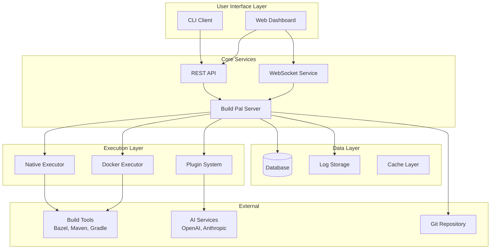
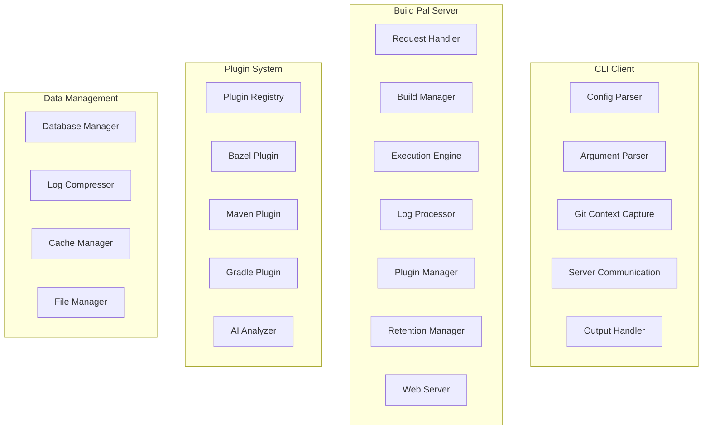

# Build Pal Design Document

## Overview

Build Pal is a comprehensive development tool that provides a unified command-line interface for executing and monitoring build commands across different project types. The system consists of four main components working together to deliver a seamless build experience:

1. **CLI Client**: Command-line tool with flexible execution modes and configuration management
2. **Background Server**: Persistent service managing build execution, log streaming, and web interface
3. **Web Dashboard**: Browser-based interface for monitoring builds, viewing history, and triggering commands
4. **Plugin System**: Extensible architecture for build tool-specific log parsing and analysis

The architecture emphasizes real-time feedback, comprehensive build context, flexible execution environments, and intelligent log analysis to enhance developer productivity.

## Architecture

### System Overview



### Component Architecture



## Core Components

### CLI Client

The CLI client serves as the primary user interface, handling configuration, git context capture, and communication with the build server.

#### Configuration Management
- Parses `.build_pal` configuration files with comprehensive validation
- Supports command-line overrides for execution mode (`--sync`, `--async`)
- Handles environment-specific settings (native vs Docker)
- Manages retention policies and plugin configurations

#### Execution Flow
1. **Argument Processing**: Parse command arguments and flags
2. **Configuration Loading**: Read and validate `.build_pal` config
3. **Mode Resolution**: Apply CLI overrides to configured execution mode
4. **Git Context Capture**: Extract branch, commit, and diff information
5. **Server Communication**: Submit build request with full context
6. **Output Handling**: Stream logs (sync mode) or provide web URL (async mode)

#### Key Interfaces
```typescript
interface CLIConfig {
  tool: 'bazel' | 'maven' | 'gradle';
  name: string;
  description?: string;
  mode: 'sync' | 'async';
  retention: 'all' | 'error';
  environment: 'native' | 'docker';
  parsing?: PluginConfig;
  ai?: AIConfig;
  docker?: DockerConfig;
}

interface BuildRequest {
  projectPath: string;
  command: string;
  config: CLIConfig;
  gitContext: GitContext;
  executionMode: 'sync' | 'async';
  triggeredFrom: 'cli' | 'web';
}
```

### Build Pal Server

The server manages all build execution, log processing, and web interface serving. It's designed for high concurrency and reliability.

#### Core Services

**Request Handler**
- REST API endpoints for build management
- WebSocket connections for real-time log streaming
- Request validation and authentication
- Rate limiting and error handling

**Build Manager**
- Build queue management and scheduling
- Process lifecycle management
- Cancellation and cleanup handling
- Status tracking and notifications

**Execution Engine**
- Environment selection (native vs Docker)
- Process spawning and monitoring
- Docker container management with rsync synchronization
- Resource management and limits
- Error capture and reporting
- File synchronization orchestration

**Log Processor**
- Real-time log streaming
- Plugin-based parsing and analysis
- Compression and deduplication
- Retention policy enforcement

#### REST API Endpoints
```
POST   /api/builds                    # Create new build
GET    /api/builds/{id}               # Get build status
DELETE /api/builds/{id}               # Cancel build
GET    /api/builds/{id}/logs          # Get build logs
POST   /api/builds/{id}/analyze       # Request AI analysis

GET    /api/projects                  # List all projects
GET    /api/projects/{id}             # Get project details
GET    /api/projects/{id}/builds      # Get project build history
GET    /api/projects/{id}/commands    # Get available commands
POST   /api/projects/{id}/builds      # Trigger build from web

GET    /api/plugins                   # List available plugins
GET    /api/health                    # Server health check
```

#### WebSocket Events
```
build.started     # Build execution started
build.log         # New log line available
build.completed   # Build finished
build.cancelled   # Build was cancelled
build.error       # Build error occurred
```

### Execution Environments

#### Native Execution
Direct execution on the host system with full access to local resources.

```typescript
interface NativeExecutor {
  executeCommand(request: BuildRequest): Promise<BuildProcess>;
  validateEnvironment(): ValidationResult;
  getSystemInfo(): SystemInfo;
}
```

**Features:**
- Direct process spawning
- Full filesystem access
- Native tool integration
- Optimal performance

#### Docker Execution
Containerized execution with bidirectional file synchronization for isolated, reproducible builds.

```typescript
interface DockerExecutor {
  executeCommand(request: BuildRequest): Promise<BuildProcess>;
  createContainer(config: DockerConfig): Promise<Container>;
  
  // Rsync-based file synchronization
  syncToContainer(localPath: string, containerPath: string, options: RsyncOptions): Promise<void>;
  syncFromContainer(containerPath: string, localPath: string, options: RsyncOptions): Promise<void>;
  
  // Container lifecycle
  startContainer(containerId: string): Promise<void>;
  stopContainer(containerId: string): Promise<void>;
  cleanupContainer(containerId: string): Promise<void>;
}

interface DockerConfig {
  image: string;
  workdir: string;
  volumes: string[];
  environment: Record<string, string>;
  rsyncOptions: string[];
  syncStrategy: 'pre-build' | 'continuous' | 'post-build';
}

interface RsyncOptions {
  excludePatterns: string[];
  includePatterns: string[];
  preservePermissions: boolean;
  deleteExtraneous: boolean;
  compressionLevel: number;
}
```

**Docker Execution Flow:**
1. **Container Creation**: Create container from specified image
2. **Pre-build Sync**: Rsync project files to container workspace
3. **Build Execution**: Run build command inside container
4. **Continuous Sync** (optional): Monitor and sync file changes during build
5. **Post-build Sync**: Rsync build artifacts back to host
6. **Container Cleanup**: Remove container and temporary resources

**Rsync Features:**
- **Bidirectional Sync**: Files sync to container before build, artifacts sync back after
- **Selective Sync**: Configurable include/exclude patterns (e.g., exclude node_modules, .git)
- **Incremental Updates**: Only sync changed files for performance
- **Compression**: Configurable compression for network efficiency
- **Permission Preservation**: Maintain file permissions across sync operations
- **Conflict Resolution**: Handle file conflicts and permission issues gracefully

**Configuration Example:**
```json
{
  "environment": "docker",
  "docker": {
    "image": "ubuntu:22.04",
    "workdir": "/workspace",
    "volumes": ["./:/workspace"],
    "environment": {
      "JAVA_HOME": "/usr/lib/jvm/java-11-openjdk"
    },
    "rsyncOptions": [
      "--exclude=node_modules",
      "--exclude=.git",
      "--exclude=target/",
      "--exclude=build/",
      "--compress-level=6",
      "--preserve-perms"
    ],
    "syncStrategy": "pre-build"
  }
}
```

### Plugin System

Extensible architecture for build tool-specific functionality and AI-powered analysis.

#### Plugin Architecture
```typescript
interface LogParsingPlugin {
  name: string;
  toolType: string;
  version: string;
  
  // Real-time parsing
  parseLogLine(line: string, context: ParsingContext): ParsedLogLine;
  
  // Batch analysis
  parseErrors(logs: string[]): ErrorSummary;
  parseTestResults(logs: string[]): TestSummary;
  extractMetadata(logs: string[]): BuildMetadata;
  
  // Configuration
  validateConfig(config: any): ValidationResult;
  getAvailableCommands(): BuildCommand[];
}
```

#### Built-in Plugins

**Bazel Plugin**
- Target-specific error parsing
- Test result extraction
- Build graph analysis
- Performance metrics

**Maven Plugin**
- Lifecycle phase tracking
- Dependency resolution errors
- Surefire/Failsafe test reports
- Plugin execution analysis

**Gradle Plugin**
- Task execution tracking
- Build script errors
- Test framework integration
- Build cache analysis

#### AI Analysis Integration
```typescript
interface AIAnalysisProvider {
  analyzeFailure(logs: string[], context: BuildContext): Promise<AnalysisResult>;
  generateSuggestions(errors: ErrorSummary): Promise<SuggestedFix[]>;
  validateConfiguration(config: AIConfig): ValidationResult;
}

interface AnalysisResult {
  summary: string;
  rootCause: string;
  suggestedFixes: SuggestedFix[];
  confidence: number;
  analysisTime: number;
}
```

### Web Dashboard

Modern, responsive web interface for build monitoring and management.

#### Core Pages

**Project Dashboard (`/`)**
- Grid view of all projects with status indicators
- Quick action buttons for common build commands
- Real-time status updates
- Search and filtering capabilities

**Build Viewer (`/builds/{id}`)**
- Real-time log streaming with syntax highlighting
- Build context panel (project, command, git info)
- Error/warning summary with jump-to-line functionality
- AI analysis results (when available)
- Build cancellation controls

**Project History (`/projects/{id}`)**
- Chronological build history with filtering
- Branch and commit information
- Build duration and status trends
- Bulk operations (cancel, retry, analyze)

**Build Command Interface**
- Available command discovery
- Parameter input and validation
- Command templates and favorites
- Batch command execution

#### Real-time Features
- WebSocket-based log streaming
- Live build status updates
- Multi-session synchronization
- Automatic reconnection handling

### Data Management

#### Database Schema
```sql
-- Core entities
CREATE TABLE projects (
    id UUID PRIMARY KEY,
    name VARCHAR(255) NOT NULL,
    path TEXT NOT NULL UNIQUE,
    tool_type VARCHAR(50) NOT NULL,
    config_json TEXT,
    created_at TIMESTAMP DEFAULT NOW(),
    updated_at TIMESTAMP DEFAULT NOW()
);

CREATE TABLE builds (
    id UUID PRIMARY KEY,
    project_id UUID NOT NULL REFERENCES projects(id),
    command TEXT NOT NULL,
    status VARCHAR(20) NOT NULL,
    execution_mode VARCHAR(20) NOT NULL,
    environment_type VARCHAR(20) NOT NULL,
    triggered_from VARCHAR(20) NOT NULL,
    start_time TIMESTAMP NOT NULL,
    end_time TIMESTAMP,
    duration_ms INTEGER,
    exit_code INTEGER,
    git_branch VARCHAR(255),
    git_commit_hash VARCHAR(40),
    git_commit_message TEXT,
    working_directory TEXT NOT NULL,
    logs_stored BOOLEAN DEFAULT TRUE,
    created_at TIMESTAMP DEFAULT NOW()
);

-- Log storage with compression
CREATE TABLE log_segments (
    id UUID PRIMARY KEY,
    content_hash VARCHAR(64) UNIQUE NOT NULL,
    compressed_content BYTEA NOT NULL,
    original_size INTEGER NOT NULL,
    compressed_size INTEGER NOT NULL,
    created_at TIMESTAMP DEFAULT NOW()
);

CREATE TABLE build_logs (
    id UUID PRIMARY KEY,
    build_id UUID NOT NULL REFERENCES builds(id),
    segment_id UUID NOT NULL REFERENCES log_segments(id),
    sequence_number INTEGER NOT NULL,
    line_start INTEGER NOT NULL,
    line_end INTEGER NOT NULL
);

-- Git context
CREATE TABLE git_diffs (
    id UUID PRIMARY KEY,
    build_id UUID NOT NULL REFERENCES builds(id),
    file_path TEXT NOT NULL,
    diff_content TEXT NOT NULL
);

-- AI analysis results
CREATE TABLE ai_analyses (
    id UUID PRIMARY KEY,
    build_id UUID NOT NULL REFERENCES builds(id),
    provider VARCHAR(50) NOT NULL,
    model VARCHAR(100) NOT NULL,
    summary TEXT NOT NULL,
    suggested_fixes JSON NOT NULL,
    confidence DECIMAL(3,2) NOT NULL,
    analysis_time_ms INTEGER NOT NULL,
    created_at TIMESTAMP DEFAULT NOW()
);
```

#### Log Management
- **Compression**: gzip compression for log content
- **Deduplication**: Content-based deduplication across builds
- **Streaming**: Chunk-based processing for large logs
- **Retention**: Configurable retention policies (all vs error-only)

#### Caching Strategy
- Build metadata caching for fast dashboard loading
- Plugin result caching for repeated analysis
- Git context caching for performance
- WebSocket connection pooling

## Configuration Management

### Project Configuration (`.build_pal`)
```json
{
  "tool": "bazel",
  "name": "my-awesome-project",
  "description": "High-performance web service",
  "mode": "async",
  "retention": "error",
  "environment": "docker",
  "parsing": {
    "plugin": "bazel-parser",
    "config": {
      "highlightWarnings": true,
      "parseTestXml": true,
      "customErrorPatterns": ["CUSTOM_ERROR: (.*)"]
    }
  },
  "docker": {
    "image": "ubuntu:22.04",
    "workdir": "/workspace",
    "volumes": ["./:/workspace"],
    "environment": {
      "JAVA_HOME": "/usr/lib/jvm/java-11-openjdk"
    },
    "rsyncOptions": [
      "--exclude=node_modules",
      "--exclude=.git", 
      "--exclude=target/",
      "--exclude=build/",
      "--compress-level=6",
      "--preserve-perms",
      "--delete"
    ],
    "syncStrategy": "pre-build"
  },
  "ai": {
    "enabled": true,
    "provider": "openai",
    "apiKey": "env:OPENAI_API_KEY",
    "model": "gpt-4",
    "maxTokens": 2000
  }
}
```

### Global Configuration
- Server port and binding configuration
- Database connection settings
- Plugin directories and loading rules
- Default retention and execution policies
- Security and authentication settings

## Error Handling and Resilience

### Error Categories
1. **Configuration Errors**: Invalid config files, missing dependencies
2. **Execution Errors**: Build failures, process crashes, timeouts
3. **Infrastructure Errors**: Database failures, network issues, disk space
4. **Plugin Errors**: Plugin crashes, parsing failures, AI service errors

### Resilience Patterns
- **Graceful Degradation**: Continue operation with reduced functionality
- **Circuit Breakers**: Prevent cascading failures in external services
- **Retry Logic**: Automatic retry with exponential backoff
- **Fallback Mechanisms**: Alternative approaches when primary methods fail

### Monitoring and Observability
- Structured logging with correlation IDs
- Metrics collection for performance monitoring
- Health checks for all critical components
- Error tracking and alerting

## Security Considerations

### Local Security Model
- Server binds only to localhost (127.0.0.1)
- No external network access required
- File system access limited to project directories
- Build processes inherit user permissions

### Data Protection
- Optional database encryption at rest
- Secure handling of API keys and credentials
- Log sanitization to remove sensitive information
- Configurable data retention policies

### Plugin Security
- Plugin sandboxing and validation
- Code signing verification for official plugins
- Resource limits to prevent abuse
- Security audit logging

## Performance Optimization

### Scalability Targets
- Support for 100+ concurrent builds
- Sub-second web interface response times
- Efficient handling of large log files (>100MB)
- Minimal memory footprint for long-running server

### Optimization Strategies
- **Streaming Processing**: Process logs in chunks to avoid memory issues
- **Connection Pooling**: Reuse database and WebSocket connections
- **Lazy Loading**: Load build history and logs on demand
- **Compression**: Reduce storage and network overhead
- **Caching**: Cache frequently accessed data and computations

## Testing Strategy

### Test Pyramid
1. **Unit Tests**: Individual component functionality
2. **Integration Tests**: Component interaction and data flow
3. **System Tests**: End-to-end user workflows
4. **Performance Tests**: Load and stress testing
5. **Security Tests**: Vulnerability and penetration testing

### Test Coverage Goals
- 90%+ code coverage for core components
- 100% coverage for critical paths (build execution, log processing)
- Comprehensive error scenario testing
- Cross-platform compatibility testing

## Deployment and Distribution

### Package Management
- **Homebrew**: macOS installation via `brew install build_pal`
- **APT**: Ubuntu/Debian installation via `apt install build_pal`
- **Binary Releases**: Pre-compiled binaries for all platforms
- **Container Images**: Docker images for containerized deployments

### Documentation Website
- Comprehensive installation and configuration guides
- Build tool-specific tutorials and examples
- API reference documentation
- Plugin development guides
- Troubleshooting and FAQ sections

### Release Strategy
- Semantic versioning (MAJOR.MINOR.PATCH)
- Automated testing and release pipeline
- Backward compatibility guarantees
- Migration guides for breaking changes