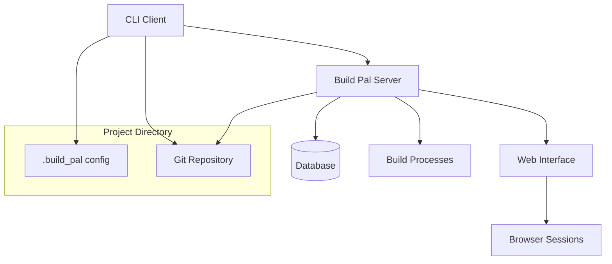
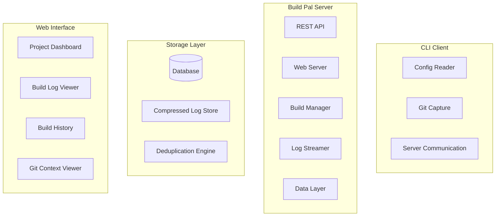

# Design Document

## Overview

Build Pal is a client-server development tool that provides a unified interface for executing and monitoring build commands across different project types. The system consists of three main components:

1. **CLI Client**: A command-line tool that detects project configuration and communicates with the server
2. **Background Server**: A persistent service that executes build commands and serves a web interface
3. **Web Interface**: A browser-based dashboard for viewing real-time logs, build history, and project management

The architecture prioritizes real-time log streaming, persistent storage with compression and deduplication, and comprehensive git integration to provide developers with full context about their builds.

## Architecture

### High-Level Architecture



### Component Architecture



## Components and Interfaces

### CLI Client

**Purpose**: Detect project configuration, capture git context, and initiate build requests.

**Key Interfaces**:
- `ConfigReader`: Parses `.build_pal` configuration files
- `GitCapture`: Extracts branch, commit, and diff information
- `ServerComm`: Communicates with the build_pal server via HTTP

**Configuration Format** (`.build_pal`):
```json
{
  "tool": "bazel|maven|gradle",
  "name": "project-name",
  "description": "Optional project description"
}
```

**CLI Command Flow**:
1. Parse command arguments (including cancellation flag `-c {slug}`)
2. If cancellation request, send cancel request to server and exit
3. Read `.build_pal` config file
4. Capture git context (branch, commit, diff)
5. Send build request to server
6. Return command ID and localhost URL for log viewing

### Build Pal Server

**Purpose**: Execute build commands, stream logs, serve web interface, and manage data persistence.

**Core Services**:

#### REST API Service
- `POST /api/builds` - Initiate new build (returns build ID and URL)
- `GET /api/builds/{id}` - Get build status and metadata
- `DELETE /api/builds/{id}` - Cancel running build
- `GET /api/builds/{id}/logs` - Stream build logs (WebSocket)
- `GET /api/projects` - List all projects
- `GET /api/projects/{id}/builds` - Get project build history

#### Build Manager Service
- Process queue management for concurrent builds
- Subprocess spawning and lifecycle management
- Build cancellation and cleanup handling
- Real-time log capture and streaming
- Build status tracking and completion handling

#### Log Streamer Service
- WebSocket connections for real-time log streaming
- Multi-session support for same build
- Log replay capability for completed builds
- Integration with compressed storage
- Real-time log parsing using build tool plugins
- Live error/warning detection and highlighting
- Progressive build summary generation
- Plugin-based metadata extraction during streaming

#### Data Layer Service
- Database connection management
- Log compression and deduplication
- Build metadata persistence
- Git context storage

### Database Schema

**Build Records**:
```sql
CREATE TABLE builds (
    id UUID PRIMARY KEY,
    project_id UUID NOT NULL,
    command TEXT NOT NULL,
    tool_type VARCHAR(50) NOT NULL,
    status VARCHAR(20) NOT NULL, -- running, success, failed, cancelled
    start_time TIMESTAMP NOT NULL,
    end_time TIMESTAMP,
    duration_ms INTEGER,
    git_branch VARCHAR(255),
    git_commit_hash VARCHAR(40),
    git_commit_message TEXT,
    git_author VARCHAR(255),
    working_directory TEXT NOT NULL,
    created_at TIMESTAMP DEFAULT NOW()
);

CREATE TABLE projects (
    id UUID PRIMARY KEY,
    name VARCHAR(255) NOT NULL,
    path TEXT NOT NULL UNIQUE,
    tool_type VARCHAR(50) NOT NULL,
    last_build_time TIMESTAMP,
    created_at TIMESTAMP DEFAULT NOW()
);

CREATE TABLE log_segments (
    id UUID PRIMARY KEY,
    content_hash VARCHAR(64) UNIQUE NOT NULL,
    compressed_content BYTEA NOT NULL,
    original_size INTEGER NOT NULL,
    compressed_size INTEGER NOT NULL,
    created_at TIMESTAMP DEFAULT NOW()
);

CREATE TABLE build_logs (
    id UUID PRIMARY KEY,
    build_id UUID NOT NULL REFERENCES builds(id),
    segment_id UUID NOT NULL REFERENCES log_segments(id),
    sequence_number INTEGER NOT NULL,
    line_start INTEGER NOT NULL,
    line_end INTEGER NOT NULL
);

CREATE TABLE git_diffs (
    id UUID PRIMARY KEY,
    build_id UUID NOT NULL REFERENCES builds(id),
    file_path TEXT NOT NULL,
    diff_content TEXT NOT NULL,
    created_at TIMESTAMP DEFAULT NOW()
);
```

### Web Interface

**Dashboard Components**:

#### Project Dashboard (`/`)
- Grid view of all projects with status indicators
- Last build time, status, and quick actions
- Search and filtering capabilities
- Getting started guidance for new users

#### Project History (`/projects/{id}`)
- Chronological list of builds for specific project
- Branch, commit, status, and duration columns
- Filtering by status, branch, date range
- Pagination for large histories

#### Build Viewer (`/builds/{id}`)
- Real-time log streaming with auto-scroll
- Build context panel (project, command, git info)
- Cancel button for running builds
- Error/warning summary at top
- Git diff and commit history tabs
- Log search and filtering

#### Build Summary Parser
- Plugin-based parsing system for different build tools
- Real-time error detection and highlighting during log streaming
- Test failure extraction with detailed context
- Build metrics calculation (duration, test counts, phases)
- Configurable parsing rules per tool type through plugin configuration
- Progressive summary updates as logs stream
- Custom error pattern support through plugin extensions

## Data Models

### Core Entities

```typescript
interface Project {
  id: string;
  name: string;
  path: string;
  toolType: 'bazel' | 'maven' | 'gradle';
  lastBuildTime?: Date;
  createdAt: Date;
}

interface Build {
  id: string;
  projectId: string;
  command: string;
  toolType: string;
  status: 'running' | 'success' | 'failed' | 'cancelled';
  startTime: Date;
  endTime?: Date;
  durationMs?: number;
  gitContext: GitContext;
  workingDirectory: string;
  createdAt: Date;
}

interface GitContext {
  branch?: string;
  commitHash?: string;
  commitMessage?: string;
  author?: string;
  uncommittedChanges: GitDiff[];
}

interface GitDiff {
  filePath: string;
  diffContent: string;
}

interface LogSegment {
  id: string;
  contentHash: string;
  compressedContent: Buffer;
  originalSize: number;
  compressedSize: number;
}

interface BuildLog {
  buildId: string;
  segments: LogSegmentReference[];
}

interface LogSegmentReference {
  segmentId: string;
  sequenceNumber: number;
  lineStart: number;
  lineEnd: number;
}
```

### Plugin Architecture for Log Parsing

The system uses a plugin-based architecture to provide build tool-specific parsing logic. This allows for extensible support of different build systems while maintaining a consistent interface for error detection, test result parsing, and metadata extraction.

#### Core Plugin System

```typescript
interface LogParsingPlugin {
  name: string;
  toolType: string;
  version: string;
  
  // Core parsing capabilities
  parseErrors(logLines: string[]): ErrorSummary;
  parseTestResults(logLines: string[]): TestSummary;
  parseMetadata(logLines: string[]): BuildMetadata;
  
  // Real-time parsing for streaming logs
  parseLogLine(line: string, context: ParsingContext): ParsedLogLine;
  
  // Configuration and validation
  validateConfig(config: any): ValidationResult;
  getDefaultConfig(): any;
}

interface ParsingContext {
  buildId: string;
  toolType: string;
  command: string;
  workingDirectory: string;
  previousLines: string[];
  currentPhase?: BuildPhase;
}

interface ParsedLogLine {
  originalLine: string;
  level: 'info' | 'warning' | 'error' | 'debug';
  category: 'build' | 'test' | 'compilation' | 'dependency' | 'other';
  metadata?: {
    testName?: string;
    fileName?: string;
    lineNumber?: number;
    errorCode?: string;
    duration?: number;
  };
  shouldHighlight: boolean;
  tags: string[];
}

interface BuildMetadata {
  buildPhases: BuildPhase[];
  dependencies: DependencyInfo[];
  artifacts: ArtifactInfo[];
  performance: PerformanceMetrics;
}

interface BuildPhase {
  name: string;
  startTime: Date;
  endTime?: Date;
  status: 'running' | 'completed' | 'failed' | 'skipped';
  logLineStart: number;
  logLineEnd?: number;
}
```

#### Plugin Registry and Management

```typescript
interface PluginRegistry {
  registerPlugin(plugin: LogParsingPlugin): void;
  getPlugin(toolType: string): LogParsingPlugin | null;
  listPlugins(): LogParsingPlugin[];
  validatePlugin(plugin: LogParsingPlugin): ValidationResult;
}

interface PluginManager {
  loadPlugins(pluginDirectory: string): Promise<void>;
  createParsingContext(build: Build): ParsingContext;
  parseLogStream(plugin: LogParsingPlugin, logStream: ReadableStream, context: ParsingContext): AsyncGenerator<ParsedLogLine>;
  generateSummary(plugin: LogParsingPlugin, logLines: string[], context: ParsingContext): BuildSummary;
}

interface BuildSummary {
  status: 'success' | 'failed' | 'cancelled';
  errors: ErrorSummary;
  tests: TestSummary;
  metadata: BuildMetadata;
  highlights: LogHighlight[];
  phases: BuildPhase[];
}

interface LogHighlight {
  lineNumber: number;
  type: 'error' | 'warning' | 'test_failure' | 'important';
  message: string;
  context?: string;
}
```

#### Built-in Plugin Implementations

**Bazel Plugin**:
```typescript
class BazelLogParsingPlugin implements LogParsingPlugin {
  name = 'bazel-parser';
  toolType = 'bazel';
  version = '1.0.0';
  
  parseErrors(logLines: string[]): ErrorSummary {
    // Parse Bazel-specific error patterns:
    // - Compilation errors with file:line:column format
    // - BUILD file syntax errors
    // - Target resolution failures
    // - Dependency conflicts
  }
  
  parseTestResults(logLines: string[]): TestSummary {
    // Parse Bazel test output:
    // - Test target results (PASSED/FAILED/TIMEOUT)
    // - Individual test case results
    // - Test execution times
    // - Coverage information
  }
  
  parseLogLine(line: string, context: ParsingContext): ParsedLogLine {
    // Real-time parsing for:
    // - Build progress indicators
    // - Target completion notifications
    // - Error/warning detection
    // - Test execution updates
  }
}
```

**Maven Plugin**:
```typescript
class MavenLogParsingPlugin implements LogParsingPlugin {
  name = 'maven-parser';
  toolType = 'maven';
  version = '1.0.0';
  
  parseErrors(logLines: string[]): ErrorSummary {
    // Parse Maven-specific patterns:
    // - Compilation errors with [ERROR] prefix
    // - Dependency resolution failures
    // - Plugin execution errors
    // - Build lifecycle failures
  }
  
  parseTestResults(logLines: string[]): TestSummary {
    // Parse Surefire/Failsafe test reports:
    // - Test suite execution results
    // - Individual test failures with stack traces
    // - Test execution statistics
    // - Skipped test information
  }
}
```

#### Plugin Configuration

Plugins can be configured through the `.build_pal` config file:

```json
{
  "tool": "bazel",
  "name": "my-project",
  "parsing": {
    "plugin": "bazel-parser",
    "config": {
      "highlightWarnings": true,
      "parseTestXml": true,
      "extractCoverage": false,
      "customErrorPatterns": [
        "CUSTOM_ERROR: (.*)"
      ]
    }
  }
}
```

#### Plugin Discovery and Loading

The system supports multiple plugin loading mechanisms:

1. **Built-in Plugins**: Core plugins for Bazel, Maven, Gradle shipped with the system
2. **Local Plugins**: Custom plugins in `.build_pal/plugins/` directory
3. **Shared Plugins**: Team-wide plugins in a shared directory
4. **Dynamic Loading**: Plugins loaded at runtime based on tool detection

```typescript
interface PluginLoader {
  loadBuiltinPlugins(): Promise<LogParsingPlugin[]>;
  loadLocalPlugins(projectPath: string): Promise<LogParsingPlugin[]>;
  loadSharedPlugins(sharedPath: string): Promise<LogParsingPlugin[]>;
  validatePluginSecurity(plugin: LogParsingPlugin): SecurityValidation;
}
```

### Build Tool Adapters

```typescript
interface BuildToolAdapter {
  name: string;
  executeCommand(command: string, workingDir: string): Promise<BuildProcess>;
  getLogParsingPlugin(): LogParsingPlugin;
  validateCommand(command: string): ValidationResult;
  getCommandSuggestions(partialCommand: string): string[];
}

interface BuildProcess {
  id: string;
  status: 'running' | 'completed' | 'failed' | 'cancelled';
  stdout: ReadableStream;
  stderr: ReadableStream;
  exitCode?: number;
  cancel(): Promise<void>;
}

interface ErrorSummary {
  errors: BuildError[];
  warnings: BuildWarning[];
  totalCount: number;
  criticalCount: number;
}

interface TestSummary {
  totalTests: number;
  passedTests: number;
  failedTests: number;
  skippedTests: number;
  failures: TestFailure[];
  executionTime: number;
}

interface BuildError {
  message: string;
  file?: string;
  line?: number;
  column?: number;
  severity: 'error' | 'warning';
  category: string;
  code?: string;
}

interface TestFailure {
  testName: string;
  className?: string;
  message: string;
  stackTrace?: string;
  executionTime?: number;
}
```

## Error Handling

### CLI Error Scenarios
- **Missing config file**: Display helpful error with setup instructions
- **Invalid config**: Show specific validation errors and examples
- **Server unreachable**: Attempt to start server, provide fallback instructions
- **Git errors**: Gracefully handle non-git projects or git command failures

### Server Error Scenarios
- **Database connection failure**: Degrade to in-memory storage with warnings
- **Build process crashes**: Capture exit codes and error output
- **Disk space issues**: Implement log rotation and cleanup policies
- **Concurrent build limits**: Queue builds with status updates

### Web Interface Error Handling
- **WebSocket disconnection**: Automatic reconnection with backoff
- **Build not found**: Clear error messages with navigation options
- **Log loading failures**: Fallback to raw log display
- **Git context unavailable**: Hide git sections gracefully

## Testing Strategy

### Unit Testing
- **CLI Components**: Config parsing, git capture, server communication
- **Server Services**: Build management, log processing, data persistence
- **Database Layer**: CRUD operations, compression, deduplication
- **Web Components**: Log parsing, error detection, UI interactions

### Integration Testing
- **End-to-end CLI workflows**: Config detection through log viewing
- **Build execution**: Real build commands with log capture
- **Multi-session log streaming**: Concurrent browser connections
- **Database persistence**: Server restart scenarios

### Performance Testing
- **Log compression ratios**: Measure storage efficiency gains
- **Concurrent build handling**: Multiple simultaneous builds
- **WebSocket scalability**: Many concurrent log viewers
- **Database query performance**: Large build history scenarios

### Build Tool Testing
- **Bazel integration**: Various target types and error scenarios
- **Maven integration**: Different lifecycle phases and failure modes
- **Error parsing accuracy**: Known error patterns for each tool
- **Cross-platform compatibility**: Different operating systems

## Security Considerations

### Local Security Model
- Server binds only to localhost (127.0.0.1)
- No external network access required
- File system access limited to project directories
- Build processes inherit user permissions

### Data Protection
- Build logs may contain sensitive information
- Database encryption at rest (optional)
- Log retention policies to prevent indefinite storage
- Secure cleanup of temporary files

### Process Isolation
- Build processes run with same user privileges
- No privilege escalation mechanisms
- Proper cleanup of zombie processes
- Resource limits to prevent system exhaustion

## Performance Optimizations

### Log Storage Efficiency
- **Compression**: Use gzip or lz4 for log content
- **Deduplication**: Hash-based content deduplication across builds
- **Streaming**: Process logs in chunks to avoid memory issues
- **Indexing**: Efficient queries for build history and search

### Real-time Streaming
- **WebSocket optimization**: Efficient message batching
- **Buffer management**: Prevent memory leaks in long builds
- **Connection pooling**: Reuse database connections
- **Caching**: Cache frequently accessed build metadata

### Scalability Considerations
- **Concurrent builds**: Process pool management
- **Database connections**: Connection pooling and limits
- **Memory usage**: Streaming processing for large logs
- **Disk usage**: Automatic cleanup of old builds