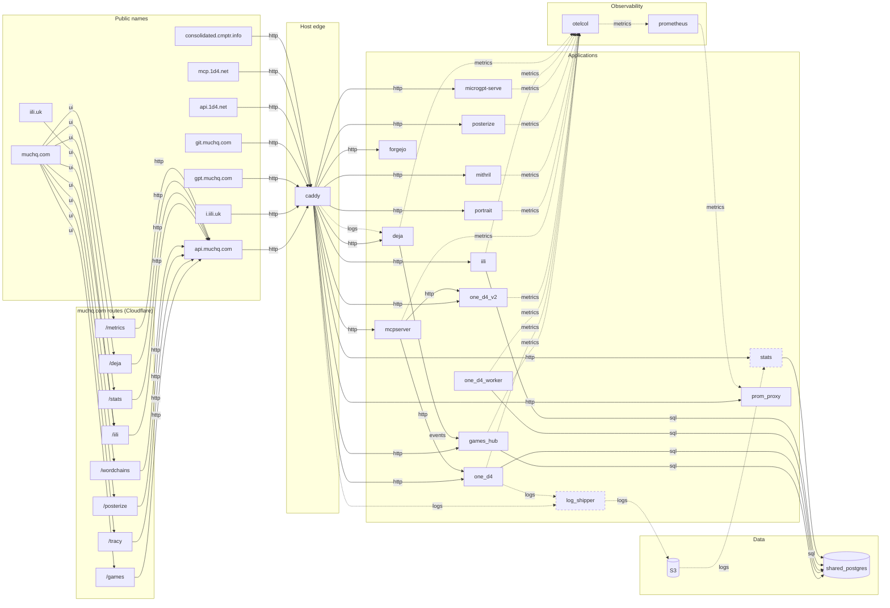

# System and Dataflow

Every container in the consolidated deployment, every public name that reaches
one, and how data moves between them.

Hand-maintained. Nothing checks it against `deploy/consolidated/compose.yaml`,
so a service added there is a service missing here until somebody adds it.

Node ids are compose service names. `ui_*` nodes are muchq.com routes, not
containers — they exist because several services are only ever reached through
a page whose name is different from theirs.



Arrows point the way data moves, which is not always the way the call goes:
`games_hub` holds `DEJA_URL` and calls `deja`, but what crosses the wire is
deja's prediction, and the lobby is what displays it.

Dashed node borders mark services behind the `stats` compose profile. They do
not start on a plain `docker compose up -d`, because both need S3 credentials
and would otherwise crash-loop.

## Public names

| Name | Served by | Reaches |
| --- | --- | --- |
| `muchq.com` | Cloudflare Workers | the SPA; its routes call `api.muchq.com` |
| `iili.uk` | Cloudflare Workers | the iili SPA |
| `api.muchq.com` | caddy | games_hub, portrait, prom_proxy, mithril, posterize, microgpt-serve, one_d4, one_d4_v2, iili, stats, deja |
| `i.iili.uk` | caddy | iili — `GET /r/*` short-link redirects only |
| `gpt.muchq.com` | caddy | microgpt-serve |
| `git.muchq.com` | caddy | forgejo |
| `api.1d4.net` | caddy | one_d4, stats |
| `mcp.1d4.net` | caddy | mcpserver — `POST /mcp` |
| `consolidated.cmptr.info` | caddy | nothing; static placeholder response |

## Routes on api.muchq.com

| Path | Backend |
| --- | --- |
| `/games/v2/session`, `/games/v2/play` | games_hub |
| `/portrait/v1/trace` | portrait |
| `/metrics/v1/*` | prom_proxy |
| `/mithril/v1/wordchain` | mithril |
| `/imagine/v1/blur`, `/imagine/v1/edges` | posterize |
| `/microgpt/v1/generate`, `/microgpt/v1/chat` | microgpt-serve |
| `/1d4/v1/health`, `/1d4/v1/index`, `/1d4/v1/index/*`, `/1d4/v1/query` | one_d4 |
| `/v2/analyze` | one_d4_v2 |
| `/iili/v1/shorten`, `/iili/v1/r/*` | iili |
| `/stats/v1/*` | stats |
| `/deja/v1/*`, `/deja/v1/next` | deja |

## The log path

The one route through the system that no config file states in one place:

```
caddy writes /var/log/caddy/access.log
  ├── deja tails it read-only, predicting the next request
  └── log_shipper rolls it to S3 and deletes the rolled file
        └── stats reads S3, aggregates into shared_postgres, serves /stats/v1
```

`one_d4` query events ride the same shipper under their own S3 partition.
Rolled files are deleted after upload, which is what keeps the host disk
bounded once shipping owns retention.

## One-shot jobs

Not in the diagram: they order a deploy rather than carry data.

| Job | Runs before |
| --- | --- |
| `games_hub_db_init` | games_hub |
| `iili_db_init` | iili |
| `one_d4_migrate` | one_d4 |
| `stats_db_init` | stats |
