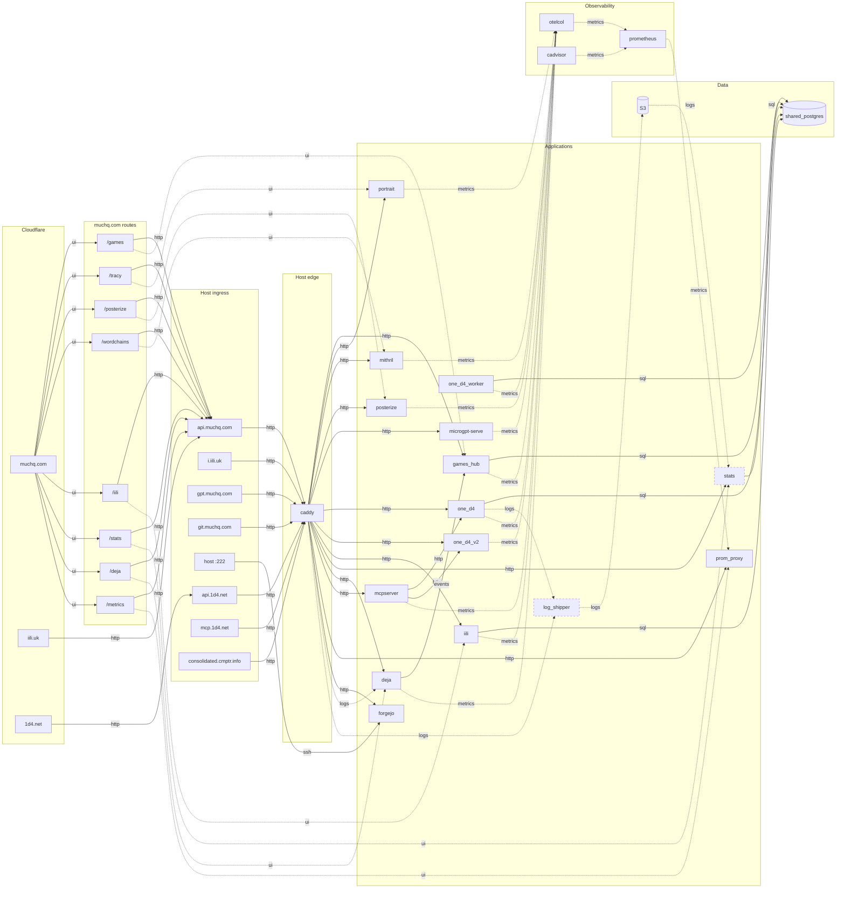

# Deployment topology

Every container in the consolidated deployment, every public name that reaches
one, and how data moves between them.

Hand-maintained; nothing checks it against `deploy/consolidated/compose.yaml`.

Node ids are compose service names wherever a container exists. `ui_*` are
muchq.com routes; the public names and `S3` are not containers either.

Arrow direction follows the label: `http`, `sql` and `ssh` point the way the
call goes, `logs`, `metrics` and `events` the way the data moves. `games_hub`
calls `deja` (`DEJA_URL`), and what comes back is deja's prediction.

Dashed borders mark the `stats` compose profile: `stats` and `log_shipper` need
S3 credentials, so `docker compose up -d` leaves them out.



## Public names

Three SPAs on Cloudflare Workers, seven caddy vhosts, and one SSH port.

| Name | Served by | Reaches |
| --- | --- | --- |
| `muchq.com` | Workers, `muchq.github.io` repo | its routes call `api.muchq.com` |
| `iili.uk` | Workers, `domains/iili/apps/iili_web` | calls `api.muchq.com` |
| `1d4.net` | Workers, `domains/games/apps/1d4_web` | calls `api.1d4.net` |
| `api.muchq.com` | caddy | games_hub, portrait, prom_proxy, mithril, posterize, microgpt-serve, one_d4, one_d4_v2, iili, stats, deja |
| `i.iili.uk` | caddy | iili — `GET`/`HEAD` `/r/*` short links. HEAD is the contract: link unfurlers use it |
| `gpt.muchq.com` | caddy | microgpt-serve |
| `git.muchq.com` | caddy | forgejo, HTTP only |
| host `:222` | published by forgejo | forgejo, git over SSH — the one ingress that skips caddy |
| `api.1d4.net` | caddy | one_d4; stats for `GET /stats/v1/one_d4/*` only |
| `mcp.1d4.net` | caddy | mcpserver — `/mcp`, any method |
| `consolidated.cmptr.info` | caddy | nothing; static placeholder response |

`mcp.1d4.net` takes any method on purpose. GET opens the SSE probe and DELETE
ends a session, and both have to reach mcpserver to get a parseable 405 rather
than Caddy's empty 200 (#1325).

## muchq.com routes

The route names and the service names disagree, and nothing else in either repo
states the mapping.

| Route | Service |
| --- | --- |
| `/games` | games_hub |
| `/tracy` | portrait |
| `/posterize` | posterize |
| `/wordchains` | mithril |
| `/iili` | iili |
| `/stats` | stats |
| `/deja` | deja |
| `/metrics` | prom_proxy |

## Routes on api.muchq.com

A request with the wrong method is a 404, not a fall-through to another
matcher (#1468).

| Method | Path | Backend |
| --- | --- | --- |
| POST | `/games/v2/session` | games_hub |
| any | `/games/v2/play` | games_hub — websocket upgrade |
| POST | `/portrait/v1/trace` | portrait |
| GET | `/metrics/v1/*` | prom_proxy |
| POST | `/mithril/v1/wordchain` | mithril |
| POST | `/imagine/v1/blur`, `/imagine/v1/edges` | posterize |
| POST | `/microgpt/v1/generate`, `/microgpt/v1/chat` | microgpt-serve |
| GET | `/1d4/v1/health` | one_d4 |
| POST | `/1d4/v1/index` | one_d4 |
| GET | `/1d4/v1/index/*` | one_d4 |
| POST | `/1d4/v1/query` | one_d4 |
| POST | `/v2/analyze` | one_d4_v2 |
| POST | `/iili/v1/shorten` | iili |
| GET | `/iili/v1/r/*` | iili |
| GET | `/stats/v1/*` | stats |
| GET | `/deja/v1/*` | deja |
| POST | `/deja/v1/next` | deja |

## The log path

```
caddy writes /var/log/caddy/access.log and rolls it (roll_size 4mb, roll_keep 5)
  ├── deja tails the live file read-only, predicting the next request
  └── log_shipper uploads rolled files to S3 and deletes each one it uploads
        └── stats reads S3, aggregates into shared_postgres, serves /stats/v1
```

Caddy owns the rolling; the shipper never touches the live log. Retention is
tuned in the Caddyfile, not in log_shipper. `one_d4` query events ride the same
shipper under their own S3 partition.

## One-shot jobs

Not in the diagram: they sequence a deploy rather than carry data.

| Job | Runs before |
| --- | --- |
| `games_hub_db_init` | games_hub |
| `iili_db_init` | iili |
| `one_d4_migrate` | one_d4 |
| `stats_db_init` | stats |
