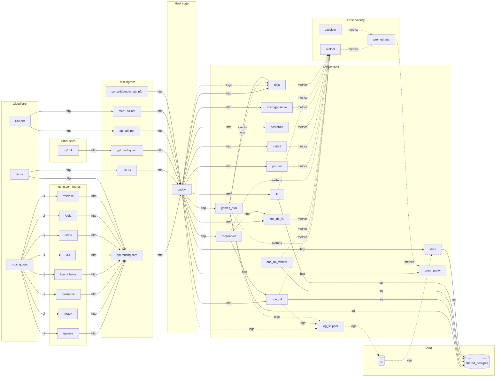

# Deployment topology

Every container in the production flow, every public name that reaches one, and
how data moves between them. `forgejo` and its `git.muchq.com` vhost run on the
same host but sit outside that flow, so they are not drawn.

Hand-maintained. Nothing checks most of it against
`deploy/consolidated/compose.yaml`; the exception is the service-to-service
HTTP calls compose declares, which `deploy_config_test` pins, along with
every `LOG_DIRS` source having a mount to read. The `sql` edges are compose's
too, as libpq URLs, which that pin does not match; prometheus's own scrape
targets live in `o11y/prometheus.yml`, which it does not read.

Node ids are compose service names wherever a container exists. `ui_*` are
muchq.com routes; the public names and `S3` are not containers either.

Arrow direction follows the label: `http` and `sql` point the way the call
goes, `logs`, `metrics` and `events` the way the data moves. `games_hub`
calls `deja` (`DEJA_URL`), and what comes back is deja's prediction.

Every request *from outside* reaches a service through caddy. Plenty of
traffic inside does not, because it is made between containers on
`app_network`. Four of those are application calls: mcpserver to one_d4
(`ONE_D4_BASE_URL`) and to one_d4_v2 (`ONE_D4_V2_BASE_URL`), games_hub to
deja (`DEJA_URL`), and prom_proxy to prometheus (`PROMETHEUS_URL`). Every
service's OTLP export to otelcol is another, and prometheus scrapes otelcol
and cadvisor on top. The diagram draws all of them.

That matters beyond the picture, but narrowly: a call that skips caddy is in
no *access log*, so it reaches no rollup computed from one — `/stats/v1`'s
summary, services, agents and countries — and no deja event from that
source. It does not
follow that the work is unrecorded. one_d4 writes its own query events, the
shipper carries them under their own partition, and `/stats/v1/one_d4/queries`
reports them with mcpserver's calls tagged `source=mcp`. So the MCP number on
the services rollup is arrivals at `mcp.1d4.net`, and the MCP number on the
query rollup is the work one_d4 did; `source.go` puts it as edge source
counts arrivals, service-local source counts work.

games_hub writes its own events for the same reason, and a stronger one: a
session opens one socket and every room, world, table, game and message
rides it, so the access log counts a connection and never a game.
`/var/log/games_hub/game_events.log` gets a line for each room made, each
join, each reshape of a world, each thing said, each table dealt, each
game that ended and each room that emptied — every line tagged with the
room it happened in, so an evening reads back as a session — and rides the
shipper under its own partition (#1571), where `/stats/v1/games_hub/events`
reports them per day.

`deploy_config_test` checks the service-to-service HTTP calls compose
declares, both ways: that each names something the network resolves, and
that the diagram draws the edge — pointing caller to callee where the label
says `http`.

Dashed borders mark the `stats` compose profile: `stats` and `log_shipper` need
S3 credentials, so `docker compose up -d` leaves them out.



## Public names

Three SPAs on Cloudflare Workers, six caddy vhosts, and one name that is
not HTTP at all.

| Name | Served by | Reaches |
| --- | --- | --- |
| `muchq.com` | Workers, `muchq.github.io` repo | its routes call `api.muchq.com` |
| `iili.uk` | Workers, `domains/iili/apps/iili_web` | calls `api.muchq.com` |
| `1d4.net` | Workers, `domains/games/apps/1d4_web` | calls `api.1d4.net` |
| `api.muchq.com` | caddy | games_hub, portrait, prom_proxy, mithril, posterize, microgpt-serve, one_d4, one_d4_v2, iili, stats, deja |
| `i.iili.uk` | caddy | iili — `GET`/`HEAD` `/r/*` short links. HEAD is the contract: link unfurlers use it |
| `gpt.muchq.com` | caddy | microgpt-serve |
| `api.1d4.net` | caddy | one_d4; stats for `GET /stats/v1/one_d4/*` only |
| `mcp.1d4.net` | caddy | mcpserver — `/mcp`, any method |
| `consolidated.cmptr.info` | caddy | nothing; static placeholder response |
| `turn.muchq.com` | coturn, host network | relays room voice (#1590): 3478 UDP/TCP, relay ports 49160–49300/udp |

`turn.muchq.com` is a plain A record at this host, not proxied: a CDN in
front of it passes no UDP. Its ports are opened on the host's firewall by
hand — nothing in this repo manages the firewall. coturn and games_hub share
`TURN_SECRET` from `~/.env`, which the deploy refuses to run without; the hub
mints each voice joiner a day's credentials from it (use-auth-secret). Put
the secret in the deploying machine's `.env` too, if it has one: `deploy.sh`
copies that file over the host's. A host behind 1:1 NAT (its public address
not on an interface) also needs `--external-ip=<public>/<private>` on coturn.
There is no TURN over TLS on 443, so a network that lets only 443 out gets
no relay.

`mcp.1d4.net` takes any method on purpose. GET opens the SSE probe and DELETE
ends a session, and both have to reach mcpserver to get a parseable 405 rather
than Caddy's empty 200 (#1325).

## muchq.com routes

The route names and the service names disagree, and nothing else in either repo
states the mapping. These are names, not a network path: the request still goes
out to `api.muchq.com` and through caddy.

| Route | Service |
| --- | --- |
| `/games` | games_hub |
| `/tracy` | portrait |
| `/posterize` | posterize |
| `/wordchains` | mithril |
| `/iili` | iili |
| `/stats` | stats |
| `/deja` | deja |
| `/metrics` | prom_proxy |

## Callers outside this repo

The muchq.com nav links eleven other sites. Three of them call in:

| Site | Calls |
| --- | --- |
| `1d4.net` | `api.1d4.net`, `mcp.1d4.net/mcp` |
| `iili.uk` | `api.muchq.com`, `i.iili.uk/r/` |
| `tty1.uk` | `gpt.muchq.com/microgpt/v1/chat` |

The other eight — snowbonk.com, hovercrap.com, 3xe.org, bitfear.net,
smallcat.dog, 2n-1.org, sato-ni-haru-ga-kimashita.uk, p2bx.uk — are
self-contained and reach nothing here.

## Routes on api.muchq.com

A request with the wrong method is a 404, not a fall-through to another
matcher (#1468).

| Method | Path | Backend |
| --- | --- | --- |
| POST | `/games/v2/session` | games_hub |
| any | `/games/v2/play` | games_hub — websocket upgrade |
| POST | `/portrait/v1/trace` | portrait |
| GET | `/metrics/v1/*` | prom_proxy |
| POST | `/mithril/v1/wordchain` | mithril |
| POST | `/imagine/v1/blur`, `/imagine/v1/edges` | posterize |
| POST | `/microgpt/v1/generate`, `/microgpt/v1/chat` | microgpt-serve |
| GET | `/1d4/v1/health` | one_d4 |
| POST | `/1d4/v1/index` | one_d4 |
| GET | `/1d4/v1/index/*` | one_d4 |
| POST | `/1d4/v1/query` | one_d4 |
| POST | `/v2/analyze` | one_d4_v2 |
| POST | `/iili/v1/shorten` | iili |
| GET | `/iili/v1/r/*` | iili |
| GET | `/stats/v1/*` | stats |
| GET | `/deja/v1/*` | deja |
| POST | `/deja/v1/next` | deja |

## The log path

```
caddy writes /var/log/caddy/access.log and rolls it (roll_size 4mb, roll_keep 5)
  ├── deja tails the live file read-only, predicting the next request
  └── log_shipper uploads rolled files to S3 and deletes each one it uploads
        └── stats reads S3, aggregates into shared_postgres, serves /stats/v1
```

Caddy owns the rolling; the shipper never touches the live log. Retention is
tuned in the Caddyfile, not in log_shipper.

Two services write domain events down the same pipe, each under its own S3
partition and each rolling hourly into a host directory `LOG_DIRS` names:
`one_d4` its query events, `games_hub` its finished games. The rule every
writer obeys is the shipper's: the file being appended to carries no
timestamp in its name, and a rolled one does — that asymmetry is the only
thing keeping the shipper from uploading and deleting a live file.

## One-shot jobs

Not in the diagram: they sequence a deploy rather than carry data.

| Job | Runs before |
| --- | --- |
| `games_hub_db_init` | games_hub |
| `iili_db_init` | iili |
| `one_d4_migrate` | one_d4 |
| `stats_db_init` | stats |
