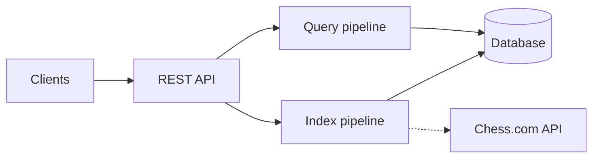
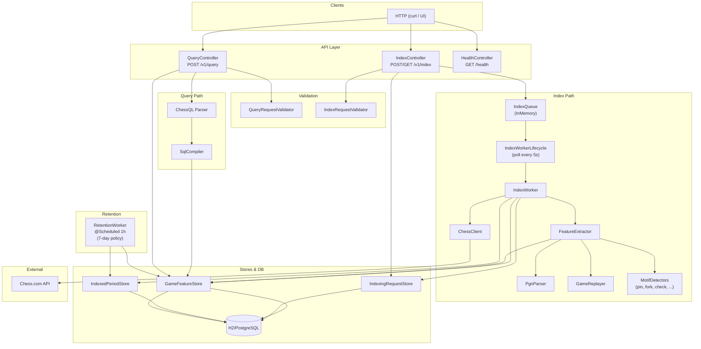

# one_d4 API

The `one_d4` API provides endpoints for indexing and querying chess game features.

## Architecture

**High-level**



**Detailed component view**



**Index flow:** Client posts to `POST /v1/index` → request is stored and a message is enqueued. A background thread (IndexWorkerLifecycle) polls the queue; IndexWorker fetches games from Chess.com per month (skipping months already in IndexedPeriodStore), runs FeatureExtractor (PgnParser → GameReplayer → MotifDetectors) on each game, and writes to GameFeatureStore (game_features + motif_occurrences) and IndexedPeriodStore. Fork occurrences are derived inside FeatureExtractor from ATTACK occurrences (same ply + attacker targeting 2+ pieces).

**Query flow:** Client posts a ChessQL string to `POST /v1/query` → Parser and SqlCompiler produce SQL → GameFeatureStore runs the query and loads motif_occurrences for the result set → response returns GameFeatureRow list with per-game occurrences.

**Retention:** RetentionWorker runs hourly and deletes game_features, motif_occurrences (via FK cascade), and indexed_periods older than 7 days.

## Running Locally (in-memory)

H2 in-memory is the default — no PostgreSQL or Docker required.

```bash
# Build and start (data lives only for the lifetime of the process)
bazel run //domains/games/apis/one_d4:one_d4
```

To use a persistent H2 file instead of the default in-memory DB:

```bash
INDEXER_DB_URL="jdbc:h2:file:/tmp/indexer;DB_CLOSE_DELAY=-1" \
  bazel run //domains/games/apis/one_d4:one_d4
```

To point at a PostgreSQL instance:

```bash
INDEXER_DB_URL="jdbc:postgresql://localhost:5432/indexer" \
INDEXER_DB_USERNAME="indexer" \
INDEXER_DB_PASSWORD="indexer" \
  bazel run //domains/games/apis/one_d4:one_d4
```

The server starts on **port 8080**. Then index a player and query:

```bash
# Index one month of games
curl -s -X POST http://localhost:8080/v1/index \
  -H 'Content-Type: application/json' \
  -d '{"player":"hikaru","platform":"CHESS_COM","startMonth":"2026-01","endMonth":"2026-01"}' \
  | jq .

# Poll until status is COMPLETE
curl -s http://localhost:8080/v1/index/{id} | jq .

# Query indexed games
curl -s -X POST http://localhost:8080/v1/query \
  -H 'Content-Type: application/json' \
  -d '{"query":"white_username = \"hikaru\"","limit":5,"offset":0}' \
  | jq .
```

> **Note:** All data is lost when the process exits when using the default in-memory database.

---

## Endpoints

### Health Check

Check the status of the service and its dependencies.

```bash
curl -X GET http://localhost:8080/health
```

### Create Indexing Request

Starts a background task to index games for a specific player on a platform within a given time range.

```bash
curl -X POST http://localhost:8080/v1/index \
  -H "Content-Type: application/json" \
  -d '{
    "player": "magnuscarlsen",
    "platform": "CHESS_COM",
    "startMonth": "2023-01",
    "endMonth": "2023-12"
  }'
```

### Get Indexing Status

Retrieves the status of a previously submitted indexing request.

```bash
curl -X GET http://localhost:8080/v1/index/{id}
```

Replace `{id}` with the UUID returned from the `POST /v1/index` request.

### Query Games

Query indexed game features using the ChessQL expression language. ChessQL is an expression-based language, not SQL. Do NOT use `SELECT` or `*`.

**Example: Query by rating**
```bash
curl -X POST http://localhost:8080/v1/query \
  -H "Content-Type: application/json" \
  -d '{
    "query": "white_elo > 2500 OR black_elo > 2500",
    "limit": 10,
    "offset": 0
  }'
```

**Example: Query by motifs**
```bash
curl -X POST http://localhost:8080/v1/query \
  -H "Content-Type: application/json" \
  -d '{
    "query": "motif(fork) AND white_elo >= 2400",
    "limit": 5
  }'
```

**Example: Query by opening (ECO)**
```bash
curl -X POST http://localhost:8080/v1/query \
  -H "Content-Type: application/json" \
  -d '{
    "query": "eco = \"B90\" AND platform IN [\"chess.com\", \"lichess\"]",
    "limit": 20
  }'
```

### Data Retention Policy

The indexer maintains a **7-day retention policy**. Games are automatically deleted 7 days after they are indexed (based on the `indexed_at` timestamp). This policy is enforced by a background worker that runs hourly.

### Available Fields

**Note:** Query fields must use **snake_case** or **dot.notation**, even though the API response returns fields in **camelCase**.

- `white_elo` (or `white.elo`)
- `black_elo` (or `black.elo`)
- `white_username` (or `white.username`)
- `black_username` (or `black.username`)
- `time_class` (or `time.class`)
- `num_moves` (or `num.moves`)
- `eco`
- `result`
- `platform`
- `game_url` (or `game.url`)
- `played_at` (or `played.at`)
- `indexed_at` (or `indexed.at`)

### Re-analyze All Games

Re-runs feature extraction on every stored game and updates motif columns and occurrences. Useful after deploying a new detector or enrichment.

```bash
curl -X POST http://localhost:8080/admin/reanalyze
```

Returns `{"gamesReanalyzed": N}`.

### Available Motifs

- `motif(attack)`
- `motif(discovered_attack)`
- `motif(discovered_check)`
- `motif(fork)`
- `motif(pin)`
- `motif(cross_pin)`
- `motif(skewer)`
- `motif(check)`
- `motif(checkmate)`
- `motif(double_check)`
- `motif(back_rank_mate)`
- `motif(smothered_mate)`
- `motif(promotion)`
- `motif(promotion_with_check)`
- `motif(promotion_with_checkmate)`
- `motif(overloaded_piece)`
- `motif(zugzwang)`

---

## Inspecting the database (deployed)

On the deployed machine the indexer uses H2 file storage at `/data/indexer` inside the container (Compose volume `one_d4_data`).

### Via the API (no direct DB access)

- **Index requests:** `GET http://localhost:8088/v1/index/{id}` — returns `id`, `status`, `gamesIndexed`, `errorMessage` for that request. There is no list-all-requests endpoint; you need the request UUID.
- **Query games:** `POST http://localhost:8088/v1/query` with a ChessQL query (e.g. `white_username = "drawlya"` or `black_username = "drawlya"`) and check the `playedAt` field in the results to see what date ranges are indexed.

### Direct H2 access (copy DB out)

1. Find the container: `docker ps | grep one_d4` (Compose names it like `*_one_d4_*`).
2. Copy the H2 files from the container (e.g. replace `CONTAINER` with the actual name):
   ```bash
   docker cp CONTAINER:/data ./one_d4_data_backup
   ```
   The DB file is `./one_d4_data_backup/indexer.mv.db`. Copying while the app is running is usually safe for a read-only snapshot; for a fully consistent copy you can stop the container first.
3. On a machine with [H2](https://www.h2database.com/) installed, open the copy:
   - **H2 Console (jar):** `java -jar h2*.jar` → JDBC URL `jdbc:h2:file:/path/to/one_d4_data_backup/indexer`, user `sa`, password blank.
   - Or use any SQL client that supports H2 (e.g. DBeaver).

Main tables:
- `indexing_requests` — id, player, platform, start_month, end_month, status, games_indexed, …
- `game_features` — request_id, game_url, played_at, indexed_at, has_fork, has_pin, has_check, … (one boolean per motif)
- `motif_occurrences` — game_url (FK), motif, move_number, ply, side, description, moved_piece, attacker, target, is_discovered, is_mate, pin_type
- `indexed_periods` — player, platform, year_month, is_complete, games_count, …
