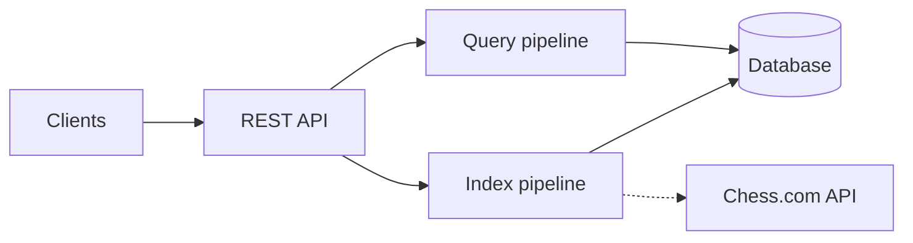
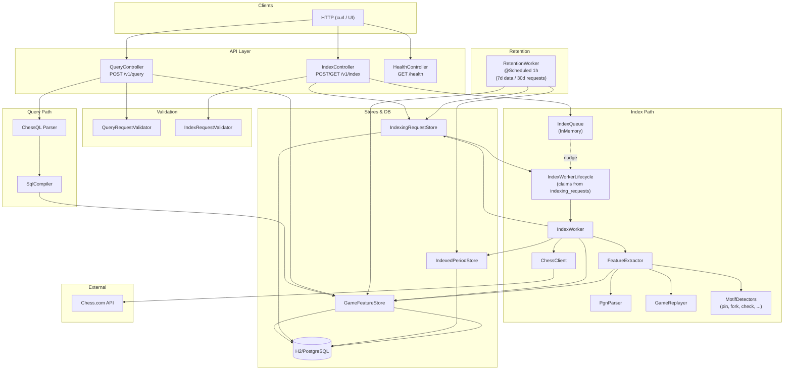

# one_d4 API

The `one_d4` API provides endpoints for indexing and querying chess game features.

## Architecture

**High-level**


```mermaid
flowchart LR
  Client["Clients"] --> API["REST API"]
  API --> Index["Index pipeline"]
  API --> Query["Query pipeline"]
  Index --> DB[(Database)]
  Query --> DB
  Index -.-> Chess["Chess.com API"]
```

**Detailed component view**


```mermaid
flowchart TB
  subgraph Client["Clients"]
    HTTP["HTTP (curl / UI)"]
  end

  subgraph API["API Layer"]
    IndexCtrl["IndexController\nPOST/GET /v1/index"]
    QueryCtrl["QueryController\nPOST /v1/query"]
    HealthCtrl["HealthController\nGET /health"]
  end

  subgraph Validation["Validation"]
    QueryVal["QueryRequestValidator"]
    IndexVal["IndexRequestValidator"]
  end

  subgraph IndexPath["Index Path"]
    Queue["IndexQueue\n(InMemory)"]
    Lifecycle["IndexWorkerLifecycle\n(claims from indexing_requests)"]
    Worker["IndexWorker"]
    ChessClient["ChessClient"]
    Extractor["FeatureExtractor"]
    PgnParser["PgnParser"]
    Replayer["GameReplayer"]
    Detectors["MotifDetectors\n(pin, fork, check, ...)"]
  end

  subgraph QueryPath["Query Path"]
    Parser["ChessQL Parser"]
    Compiler["SqlCompiler"]
  end

  subgraph Retention["Retention"]
    RetentionWorker["RetentionWorker\n@Scheduled 1h\n(7d data / 30d requests)"]
  end

  subgraph Store["Stores & DB"]
    RequestStore["IndexingRequestStore"]
    GameStore["GameFeatureStore"]
    PeriodStore["IndexedPeriodStore"]
    DB[(H2/PostgreSQL)]
  end

  subgraph External["External"]
    ChessAPI["Chess.com API"]
  end

  HTTP --> IndexCtrl
  HTTP --> QueryCtrl
  HTTP --> HealthCtrl
  IndexCtrl --> IndexVal
  IndexCtrl --> RequestStore
  IndexCtrl --> Queue
  QueryCtrl --> QueryVal
  QueryCtrl --> Parser
  Parser --> Compiler
  Compiler --> GameStore
  QueryCtrl --> GameStore
  GameStore --> DB
  RequestStore --> DB
  PeriodStore --> DB

  RequestStore --> Lifecycle
  Queue -.nudge.-> Lifecycle
  Lifecycle --> Worker
  Worker --> ChessClient
  Worker --> RequestStore
  Worker --> PeriodStore
  Worker --> Extractor
  Worker --> GameStore
  ChessClient --> ChessAPI
  Extractor --> PgnParser
  Extractor --> Replayer
  Extractor --> Detectors
  Extractor --> GameStore
  GameStore --> DB

  RetentionWorker --> GameStore
  RetentionWorker --> PeriodStore
  RetentionWorker --> RequestStore
```

**Index flow:** Client posts to `POST /v1/index` → a row is stored in `indexing_requests`, which is the work queue. A background thread (IndexWorkerLifecycle) on **any** instance claims the oldest unheld row and takes a lease on it; a local in-memory nudge just wakes the poller sooner. IndexWorker fetches games from Chess.com per month (skipping months already in IndexedPeriodStore), runs FeatureExtractor (PgnParser → GameReplayer → MotifDetectors) on each game, and writes to GameFeatureStore (game_features + motif_occurrences) and IndexedPeriodStore. Fork occurrences are derived inside FeatureExtractor from ATTACK occurrences (same ply + attacker targeting 2+ pieces).

**Query flow:** Client posts a ChessQL string to `POST /v1/query` → Parser and SqlCompiler produce SQL → GameFeatureStore runs the query and loads motif_occurrences for the result set → response returns GameFeatureRow list with per-game occurrences.

**First-page cache:** The exact request 1d4_web fires on first load (`num.moves >= 0`, limit 25, offset 0, no player) is answered from an in-memory snapshot kept warm by FirstPageWarmer, which re-runs the query every 30s — scheduled rather than lazily populated because on a low-traffic site a lazy cache misses for exactly the first visitor it exists for. Staleness is bounded at ~60s by time, not by write invalidation, since index workers on other JVMs can write to the shared database; a snapshot older than that is reloaded through the cache on demand, with concurrent cold misses sharing a single query. See `docs/API.md` § First-page cache.

**Retention:** RetentionWorker runs hourly. It deletes game_features, motif_occurrences (via FK cascade), and indexed_periods older than 7 days, and indexing_requests older than 30 days — games first, so a request and its games clear in one pass. It also settles live requests nobody is working on: a lapsed lease returns the work to the queue for another worker, and only an exhausted attempt count or a fleet that is demonstrably not running anything retires a request to FAILED. Since the sweep is hourly, those windows say when a request becomes eligible, not when it is settled.

## Running Locally (in-memory)

H2 in-memory is the default — no PostgreSQL or Docker required.

```bash
# Build and start (data lives only for the lifetime of the process)
bazel run //domains/games/apis/one_d4:one_d4
```

To use a persistent H2 file instead of the default in-memory DB:

```bash
INDEXER_DB_URL="jdbc:h2:file:/tmp/indexer;DB_CLOSE_DELAY=-1" \
  bazel run //domains/games/apis/one_d4:one_d4
```

To point at a PostgreSQL or Neon instance, embed credentials in the URL:

```bash
INDEXER_DB_URL="jdbc:postgresql://localhost:5432/indexer?user=indexer&password=indexer" \
  bazel run //domains/games/apis/one_d4:one_d4
```

On a deployed server, place the JDBC URL in `/etc/one_d4/db_config` (plain text, one
line) instead of using an environment variable. The app resolves config in this order:

1. `INDEXER_DB_URL` environment variable
2. `/etc/one_d4/db_config` file
3. H2 in-memory (local dev fallback)

For Neon, the URL looks like:
```
jdbc:postgresql://ep-xxx.us-east-2.aws.neon.tech/dbname?user=xxx&password=xxx&sslmode=require&socketTimeout=30
```

Include `socketTimeout` (seconds) on any remote Postgres URL. The application bounds read-query
*execution* with a 10s JDBC statement timeout, but that cancellation travels over the network — on
a dead network only a driver-level socket timeout gets the connection back. Without it, a TCP
black hole can still hang a query indefinitely.

The server starts on **port 8080**. Then index a player and query:

```bash
# Index one month of games
curl -s -X POST http://localhost:8080/v1/index \
  -H 'Content-Type: application/json' \
  -d '{"player":"hikaru","platform":"CHESS_COM","startMonth":"2026-01","endMonth":"2026-01"}' \
  | jq .

# Poll until status is COMPLETE
curl -s http://localhost:8080/v1/index/{id} | jq .

# Query indexed games
curl -s -X POST http://localhost:8080/v1/query \
  -H 'Content-Type: application/json' \
  -d '{"query":"white_username = \"hikaru\"","limit":5,"offset":0}' \
  | jq .
```

> **Note:** All data is lost when the process exits when using the default in-memory database.

---

## Endpoints

### Health Check

Check the status of the service and its dependencies.

```bash
curl -X GET http://localhost:8080/health
```

### Create Indexing Request

Starts a background task to index games for a specific player on a platform within a given time range.

```bash
curl -X POST http://localhost:8080/v1/index \
  -H "Content-Type: application/json" \
  -d '{
    "player": "magnuscarlsen",
    "platform": "CHESS_COM",
    "startMonth": "2023-01",
    "endMonth": "2023-12"
  }'
```

### Get Indexing Status

Retrieves the status of a previously submitted indexing request.

```bash
curl -X GET http://localhost:8080/v1/index/{id}
```

Replace `{id}` with the UUID returned from the `POST /v1/index` request.

### Query Games

Query indexed game features using the ChessQL expression language. ChessQL is an expression-based language, not SQL. Do NOT use `SELECT` or `*`.

**Example: Query by rating**
```bash
curl -X POST http://localhost:8080/v1/query \
  -H "Content-Type: application/json" \
  -d '{
    "query": "white_elo > 2500 OR black_elo > 2500",
    "limit": 10,
    "offset": 0
  }'
```

**Example: Query by motifs**
```bash
curl -X POST http://localhost:8080/v1/query \
  -H "Content-Type: application/json" \
  -d '{
    "query": "motif(fork) AND white_elo >= 2400",
    "limit": 5
  }'
```

**Example: Query by opening (ECO)**
```bash
curl -X POST http://localhost:8080/v1/query \
  -H "Content-Type: application/json" \
  -d '{
    "query": "eco = \"B90\" AND platform IN [\"chess.com\", \"lichess\"]",
    "limit": 20
  }'
```

### Data Retention Policy

Two windows, both enforced by a background worker that runs hourly:

| What | Window | Measured from |
|---|---|---|
| `game_features` (and `motif_occurrences` via FK cascade), `indexed_periods` | **7 days** | `indexed_at` / `fetched_at` |
| `indexing_requests` | **30 days** | `created_at` |

Requests outlive their games on purpose. `game_features.request_id` is a foreign key onto
`indexing_requests(id)`, so a request cannot be deleted while its games remain — and in the gap
between the two windows the surviving row is what lets `GET /v1/index/{id}` report `EXPIRED`
("pruned — re-run it") rather than 404. The sweep deletes games before requests so both clear in
one pass, and skips any request still referenced by a game.

Separately, a live request that nobody is working on is settled by the retention worker. Three
outcomes, because "nobody is working on it" means three different things:

| Situation | Outcome | Why |
|---|---|---|
| Claimed, owner stopped renewing, attempts remain | **Requeued** | The owner is gone; the work is not. Another worker picks it up. Silent — the user is not told about work that is about to run. |
| Claimed 3 times, each worker stopped before finishing | **FAILED** (poisoned) | Requeuing is unbounded by construction, so a request that kills its worker would tour the fleet forever. |
| Untouched for **1 hour**, and no worker anywhere holds a lease | **FAILED** (stalled) | Every instance is down or partitioned. Nothing will run this, and silence is a worse answer than failure. |

That last row's second condition is load-bearing. Age alone cannot tell "nothing is serving this"
from "my turn hasn't come" — one worker draining a deep backlog leaves rows at the back untouched
for as long as the backlog takes — so the sweep stays quiet while any worker holds a live lease.

The situations overlap, so the sweep applies them **poisoned, stalled, requeued** and the first
match wins. A row at the attempt limit is usually also old and unheld, and both arms would fail it,
but only one gives the user the real reason; and requeuing stamps `updated_at`, so doing it first
would make a row look freshly touched and hide it from the staleness check for another whole hour.

None of the three covers a worker that is *alive but not getting anywhere*, and no better probe
could: a run wedged on a hung socket renews from its heartbeat thread, so it answers "yes, I'm
here" honestly while going nowhere. Worse, the stalled arm asks whether **any** worker holds a live
lease, so one wedged run vouches for the entire fleet and every other queued request waits in
silence behind it. The bound is a ceiling on how long one claim may be renewed — **6 hours**, far
above any legitimate run. Past it the heartbeat stops, the lease lapses, and the request is
requeued at the cost of one attempt. It caps renewal, not writes: a run that crosses the ceiling
holding a valid lease may finish what it is already inside.

Crossing the ceiling also interrupts the run's thread, and the two halves recover different things.
Letting the lease lapse recovers the **request** — another worker takes the row. The interrupt
recovers the **worker**, whose poller is a single thread: without it the instance that hit the
wedge stops taking work entirely and does not start again until someone restarts it, so a fleet
would recover its rows one at a time while shedding an instance for each one. It is best-effort by
nature — an interrupt ends a run only if what the run is blocked on honours it, which the JDK
`HttpClient` sends and body reads a worker actually waits in do, and a lock held forever by another
thread does not — and the row is recovered either way. The unwind keys on the interrupt status: a
body read leaves it set itself, while a send throws with it cleared and `Jdk11HttpClient` restores
it before rethrowing, which is why that restore matters here and is not just tidiness. A run that
has been interrupted does not record FAILED: it was stopped, not broken, and the range goes back to
the queue rather than being blamed for the worker.

What it does do is let go of the row, and that is the part that keeps the ceiling honest. `claim`
holds `attempts` flat when the same owner re-claims — deliberately, so a run can renew across its
own retries — and the worker that just gave up a wedged run is the same process whose poller sees
the row next. Left owned, it would re-claim its own abandoned request every five minutes, take a
fresh ceiling, and wedge again on a counter that never moved, with each lap's live lease vouching
for the whole fleet. So the interrupt path clears `owner_id` without returning the attempt: three
wedges retire the request and tell the user, rather than looping on it forever.

None of that covers a worker that is *leaving on purpose* either, and it can't: every arm above
needs the owner to have stopped answering, which a deploy only looks like after the lease expires.
So a shutting-down worker hands its request back itself — unclaimed immediately, and with the
attempt returned. The attempt matters more than the five minutes: `attempts` is spent on claim so that a
request which kills its worker outright still moves the counter, which means a process exit is
otherwise indistinguishable from a crash, and a long-running request outliving three rolling
restarts would be retired as poisoned. A hand-back is the evidence that resolves it — the worker
survived long enough to say it was going, which is exactly what a killer request prevents.

### Dispatch

`indexing_requests` is the work queue. Any worker claims the oldest request nobody holds, runs it,
and renews a lease while it does; every write is fenced on that ownership, so two instances polling
one table cannot end up on the same range. The in-memory queue still exists but only as a wake-up
nudge for the instance that accepted the submit — losing it costs latency, not work.

This is what makes horizontal scale-out work. Previously a request could only ever be processed by
the process that accepted it: adding an instance added no throughput for queued work, a restart lost
the messages while the rows survived, and with REST and MCP as separate JVMs against one Postgres,
load landed wherever the submit happened to arrive.

### Available Fields

**Note:** Query fields must use **snake_case** or **dot.notation**, even though the API response returns fields in **camelCase**.

- `white_elo` (or `white.elo`)
- `black_elo` (or `black.elo`)
- `white_username` (or `white.username`)
- `black_username` (or `black.username`)
- `time_class` (or `time.class`)
- `num_moves` (or `num.moves`)
- `eco`
- `result`
- `platform`
- `game_url` (or `game.url`)
- `played_at` (or `played.at`)
- `indexed_at` (or `indexed.at`)

### Re-analyze All Games

Re-runs feature extraction on every stored game and updates motif columns and occurrences. Useful after deploying a new detector or enrichment.

```bash
curl -X POST http://localhost:8080/admin/reanalyze
```

Returns `{"gamesReanalyzed": N}`.

### Available Motifs

- `motif(attack)`
- `motif(discovered_attack)`
- `motif(discovered_check)`
- `motif(fork)`
- `motif(pin)`
- `motif(cross_pin)`
- `motif(skewer)`
- `motif(check)`
- `motif(checkmate)`
- `motif(double_check)`
- `motif(back_rank_mate)`
- `motif(smothered_mate)`
- `motif(promotion)`
- `motif(promotion_with_check)`
- `motif(promotion_with_checkmate)`
- `motif(overloaded_piece)`
- `motif(zugzwang)`

---

## Inspecting the database (deployed)

On the deployed machine the indexer uses H2 file storage at `/data/indexer` inside the container (Compose volume `one_d4_data`).

### Via the API (no direct DB access)

- **Index requests:** `GET http://localhost:8088/v1/index/{id}` — returns `id`, `status`, `gamesIndexed`, `errorMessage` and a `data` block for that request. `GET http://localhost:8088/v1/index` lists the 50 most recent, newest first, so you do not need the UUID to look around.
- **Query games:** `POST http://localhost:8088/v1/query` with a ChessQL query (e.g. `white_username = "drawlya"` or `black_username = "drawlya"`) and check the `playedAt` field in the results to see what date ranges are indexed.

### Direct H2 access (copy DB out)

1. Find the container: `docker ps | grep one_d4` (Compose names it like `*_one_d4_*`).
2. Copy the H2 files from the container (e.g. replace `CONTAINER` with the actual name):
   ```bash
   docker cp CONTAINER:/data ./one_d4_data_backup
   ```
   The DB file is `./one_d4_data_backup/indexer.mv.db`. Copying while the app is running is usually safe for a read-only snapshot; for a fully consistent copy you can stop the container first.
3. On a machine with [H2](https://www.h2database.com/) installed, open the copy:
   - **H2 Console (jar):** `java -jar h2*.jar` → JDBC URL `jdbc:h2:file:/path/to/one_d4_data_backup/indexer`, user `sa`, password blank.
   - Or use any SQL client that supports H2 (e.g. DBeaver).

Main tables:
- `indexing_requests` — id, player, platform, start_month, end_month, status, games_indexed, …
- `game_features` — request_id, game_url, played_at, indexed_at, pgn, elo, eco, etc.
- `motif_occurrences` — game_url (FK), motif, move_number, ply, side, description, moved_piece, attacker, target, is_discovered, is_mate, pin_type
- `indexed_periods` — player, platform, year_month, is_complete, games_count, …
