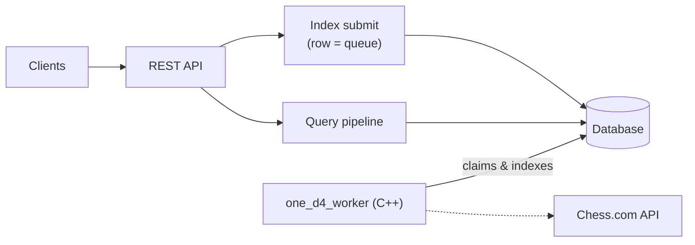
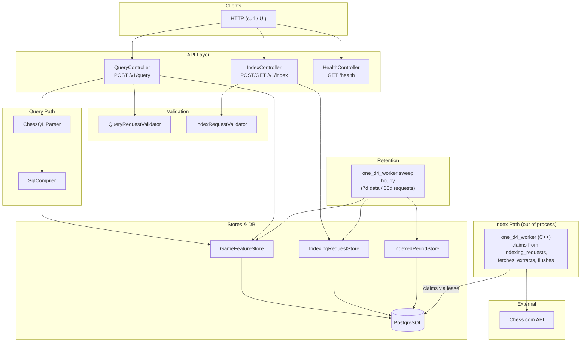

# one_d4 API

The `one_d4` API provides endpoints for indexing and querying chess game features.

**This JVM runs no chess** (#1389): submitting an index or reanalysis request
writes a row, and the C++ `one_d4_worker` claims it off the table; ad-hoc
analysis is `one_d4_v2`'s `/v2/analyze`. What lives here is the API surface,
ChessQL, the query side, the schema and its migrations, and retention.

## Architecture

**High-level**


```mermaid
flowchart LR
  Client["Clients"] --> API["REST API"]
  API --> Submit["Index submit\n(row = queue)"]
  API --> Query["Query pipeline"]
  Submit --> DB[(Database)]
  Query --> DB
  Worker["one_d4_worker (C++)"] -->|claims & indexes| DB
  Worker -.-> Chess["Chess.com API"]
```

**Detailed component view**


```mermaid
flowchart TB
  subgraph Client["Clients"]
    HTTP["HTTP (curl / UI)"]
  end

  subgraph API["API Layer"]
    IndexCtrl["IndexController\nPOST/GET /v1/index"]
    QueryCtrl["QueryController\nPOST /v1/query"]
    HealthCtrl["HealthController\nGET /health"]
  end

  subgraph Validation["Validation"]
    QueryVal["QueryRequestValidator"]
    IndexVal["IndexRequestValidator"]
  end

  subgraph IndexPath["Index Path (out of process)"]
    Worker["one_d4_worker (C++)\nclaims from indexing_requests,\nfetches, extracts, flushes"]
  end

  subgraph QueryPath["Query Path"]
    Parser["ChessQL Parser"]
    Compiler["SqlCompiler"]
  end

  subgraph Retention["Retention"]
    RetentionSweep["one_d4_worker sweep\nhourly\n(7d data / 30d requests)"]
  end

  subgraph Store["Stores & DB"]
    RequestStore["IndexingRequestStore"]
    GameStore["GameFeatureStore"]
    PeriodStore["IndexedPeriodStore"]
    DB[(PostgreSQL)]
  end

  subgraph External["External"]
    ChessAPI["Chess.com API"]
  end

  HTTP --> IndexCtrl
  HTTP --> QueryCtrl
  HTTP --> HealthCtrl
  IndexCtrl --> IndexVal
  IndexCtrl --> RequestStore
  QueryCtrl --> QueryVal
  QueryCtrl --> Parser
  Parser --> Compiler
  Compiler --> GameStore
  QueryCtrl --> GameStore
  GameStore --> DB
  RequestStore --> DB
  PeriodStore --> DB

  Worker -->|claims via lease| DB
  Worker --> ChessAPI

  RetentionSweep --> GameStore
  RetentionSweep --> PeriodStore
  RetentionSweep --> RequestStore
```

**Index flow:** Client posts to `POST /v1/index` → a row is stored in `indexing_requests`, which is the work queue — creating the row is the whole dispatch. `one_d4_worker` (see `domains/games/apis/one_d4_worker`) polls that table, claims the oldest unheld row under a lease, fetches games from Chess.com per month (skipping months already in IndexedPeriodStore), runs the detectors from `one_d4_motifs`, and flushes to game_features + motif_occurrences and IndexedPeriodStore. Callers follow the request via `GET /v1/index/{id}`.

**Query flow:** Client posts a ChessQL string to `POST /v1/query` → Parser and SqlCompiler produce SQL → GameFeatureStore runs the query and loads motif_occurrences for the result set → response returns GameFeatureRow list with per-game occurrences.

**First-page cache:** The exact request 1d4_web fires on first load (`num.moves >= 0`, limit 25, offset 0, no player) is answered from an in-memory snapshot kept warm by FirstPageWarmer, which re-runs the query every 30s — scheduled rather than lazily populated because on a low-traffic site a lazy cache misses for exactly the first visitor it exists for. Staleness is bounded at ~60s by time, not by write invalidation, since index workers on other JVMs can write to the shared database; a snapshot older than that is reloaded through the cache on demand, with concurrent cold misses sharing a single query. See `docs/API.md` § First-page cache.

**Retention:** the sweep runs hourly, in `one_d4_worker` rather than here (#1424) — its
guarantees are cross-worker facts ("no worker anywhere holds a live lease"), so it lives in the
process that holds the leases. It deletes game_features, motif_occurrences (via FK cascade), and indexed_periods older than 7 days, and indexing_requests older than 30 days — games first, so a request and its games clear in one pass. It also settles live requests nobody is working on: a lapsed lease returns the work to the queue for another worker, and only an exhausted attempt count or a fleet that is demonstrably not running anything retires a request to FAILED. Since the sweep is hourly, those windows say when a request becomes eligible, not when it is settled.

## Running Locally

one_d4 needs a real PostgreSQL. **H2 is a test dependency** — the driver is not on the
service's classpath — so there is no in-memory mode and no default URL. An unset
`INDEXER_DB_URL` fails at startup, rather than quietly starting on a database that
disappears with the process.

```bash
docker run -d --name one_d4_dev -p 5432:5432 \
  -e POSTGRES_USER=indexer -e POSTGRES_PASSWORD=indexer -e POSTGRES_DB=indexer postgres:18

INDEXER_DB_URL="jdbc:postgresql://localhost:5432/indexer" \
  INDEXER_DB_USERNAME=indexer \
  INDEXER_DB_PASSWORD=indexer \
  bazel run //domains/games/apis/one_d4:one_d4
```

`postgres:18` is the image the deploy runs (`shared_postgres` in `compose.yaml`), so local
dev and production speak the same dialect. Migrations run at startup against an empty
database, so nothing else is needed to bring one up.

The schema itself is the numbered `.sql` files in [`migrations/`](migrations/) (#1419) —
`Migration` applies them at boot, and the deploy runs the same files first as the
`one_d4_migrate` one-shot (`compose.yaml`), which is what lets `one_d4_worker` start
without waiting for this service. `migrations/README.md` has the authoring rules.

Credentials in the URL still work, but only if the password survives URL decoding —
pgjdbc decodes query values, so `+` becomes a space, `&` truncates the rest, and a bare
`%` fails to parse. The separate variables have no such constraint; see
`DataSourceFactory.create`.

The app resolves the URL from `INDEXER_DB_URL` and nowhere else: no host file, no
default. Tests are the exception and don't go through this path at all — they set the
`indexer.db.url` Micronaut property directly, which is how each `ApplicationContext`
gets its own H2 database.

**On the deployed server** `compose.yaml` sets `INDEXER_DB_URL`, `INDEXER_DB_USERNAME` and
`INDEXER_DB_PASSWORD` (MoonBase#1351), and `deploy/consolidated/deploy_config_test.go`
fails if it stops setting the URL.

For Neon, the URL looks like:
```
jdbc:postgresql://ep-xxx.us-east-2.aws.neon.tech/dbname?user=xxx&password=xxx&sslmode=require
```

Postgres URLs get a default `socketTimeout=150` (seconds) from `DataSourceFactory` unless the URL
already carries one. The application bounds query *execution* with JDBC statement timeouts, but
that cancellation travels over the network — on a dead network only a driver-level socket timeout
gets the connection back. If you override it in the URL, keep it above the retention sweep's 120s
statement bound: a long DELETE sends nothing over the socket until it finishes, and a smaller
value would sever a healthy connection mid-sweep.

The server starts on **port 8080**. Then index a player and query:

```bash
# Index one month of games
curl -s -X POST http://localhost:8080/v1/index \
  -H 'Content-Type: application/json' \
  -d '{"player":"hikaru","platform":"CHESS_COM","startMonth":"2026-01","endMonth":"2026-01"}' \
  | jq .

# Poll until status is COMPLETE
curl -s http://localhost:8080/v1/index/{id} | jq .

# Query indexed games
curl -s -X POST http://localhost:8080/v1/query \
  -H 'Content-Type: application/json' \
  -d '{"query":"white_username = \"hikaru\"","limit":5,"offset":0}' \
  | jq .
```

---

## Endpoints

### Health Check

Check the status of the service and its dependencies.

```bash
curl -X GET http://localhost:8080/health
```

### Create Indexing Request

Starts a background task to index games for a specific player on a platform within a given time range.

```bash
curl -X POST http://localhost:8080/v1/index \
  -H "Content-Type: application/json" \
  -d '{
    "player": "magnuscarlsen",
    "platform": "CHESS_COM",
    "startMonth": "2023-01",
    "endMonth": "2023-12"
  }'
```

### Get Indexing Status

Retrieves the status of a previously submitted indexing request.

```bash
curl -X GET http://localhost:8080/v1/index/{id}
```

Replace `{id}` with the UUID returned from the `POST /v1/index` request.

### Query Games

Query indexed game features using the ChessQL expression language. ChessQL is an expression-based language, not SQL. Do NOT use `SELECT` or `*`.

**Example: Query by rating**
```bash
curl -X POST http://localhost:8080/v1/query \
  -H "Content-Type: application/json" \
  -d '{
    "query": "white_elo > 2500 OR black_elo > 2500",
    "limit": 10,
    "offset": 0
  }'
```

**Example: Query by motifs**
```bash
curl -X POST http://localhost:8080/v1/query \
  -H "Content-Type: application/json" \
  -d '{
    "query": "motif(fork) AND white_elo >= 2400",
    "limit": 5
  }'
```

**Example: Query by opening (ECO)**
```bash
curl -X POST http://localhost:8080/v1/query \
  -H "Content-Type: application/json" \
  -d '{
    "query": "eco = \"B90\" AND platform IN [\"chess.com\", \"lichess\"]",
    "limit": 20
  }'
```

### Data Retention Policy

The numbers below are `retention_policy.json`, which is where they live — not in either language
(#1424). The C++ worker reads it out of its image at startup, and the Java service reads the same
file off its classpath at class load, so neither holds a copy that could drift from the other. A
window is changed by editing the file.

That makes a malformed file a startup failure rather than a compile error, and both sides refuse to
run on one: each checks every window is present, integral and positive, the worker exits 1 and the
service fails class initialisation — eagerly, from a `@Context` bean, so it is a failed startup and
not a healthy container that 500s every request.

The *relationships* between the windows are checked only by the worker, which is the process that
deletes; a contradictory file would stop it while the service went on quoting expiry dates. That
asymmetry is bounded by the build rather than by the runtime: `retention_policy_test` loads the
shipped file and asserts every relationship, without needing a database, so a policy that would
take the worker down fails CI instead of the next deploy.

This section is the rationale for the numbers; the JSON is the numbers.

Two windows, both enforced by the hourly sweep in `one_d4_worker`:

| What | Window | Measured from |
|---|---|---|
| `game_features` (and `motif_occurrences` via FK cascade), `indexed_periods` | **7 days** | `indexed_at` / `fetched_at` |
| `indexing_requests` | **30 days** | `created_at` |

Requests outlive their games on purpose. `game_features.request_id` is a foreign key onto
`indexing_requests(id)`, so a request cannot be deleted while its games remain — and in the gap
between the two windows the surviving row is what lets `GET /v1/index/{id}` report `EXPIRED`
("pruned — re-run it") rather than 404. The sweep deletes games before requests so both clear in
one pass, and skips any request still referenced by a game.

Separately, a live request that nobody is working on is settled by the same sweep. Three
outcomes, because "nobody is working on it" means three different things:

| Situation | Outcome | Why |
|---|---|---|
| Claimed, owner stopped renewing, attempts remain | **Requeued** | The owner is gone; the work is not. Another worker picks it up. Silent — the user is not told about work that is about to run. |
| Claimed 3 times, each worker stopped before finishing | **FAILED** (poisoned) | Requeuing is unbounded by construction, so a request that kills its worker would tour the fleet forever. |
| Untouched for **1 hour**, and no worker anywhere holds a lease | **FAILED** (stalled) | Every instance is down or partitioned. Nothing will run this, and silence is a worse answer than failure. |

That last row's second condition is load-bearing. Age alone cannot tell "nothing is serving this"
from "my turn hasn't come" — one worker draining a deep backlog leaves rows at the back untouched
for as long as the backlog takes — so the sweep stays quiet while any worker holds a live lease.

The situations overlap, so the sweep applies them **poisoned, stalled, requeued** and the first
match wins. A row at the attempt limit is usually also old and unheld, and both arms would fail it,
but only one gives the user the real reason; and requeuing stamps `updated_at`, so doing it first
would make a row look freshly touched and hide it from the staleness check for another whole hour.

None of the three covers a worker that is *alive but not getting anywhere*, and no better probe
could: a run wedged on a hung socket renews from its heartbeat thread, so it answers "yes, I'm
here" honestly while going nowhere. Worse, the stalled arm asks whether **any** worker holds a live
lease, so one wedged run vouches for the entire fleet and every other queued request waits in
silence behind it. The bound is a ceiling on how long one claim may be renewed — **6 hours**, far
above any legitimate run. Past it the heartbeat stops, the lease lapses, and the request is
requeued at the cost of one attempt. It caps renewal, not writes: a run that crosses the ceiling
holding a valid lease may finish what it is already inside.

Crossing the ceiling also interrupts the run's thread, and the two halves recover different things.
Letting the lease lapse recovers the **request** — another worker takes the row. The interrupt
recovers the **worker**, whose poller is a single thread: without it the instance that hit the
wedge stops taking work entirely and does not start again until someone restarts it, so a fleet
would recover its rows one at a time while shedding an instance for each one. It is best-effort by
nature — an interrupt ends a run only if what the run is blocked on honours it, which the JDK
`HttpClient` sends and body reads a worker actually waits in do, and a lock held forever by another
thread does not — and the row is recovered either way. The unwind keys on the interrupt status: a
body read leaves it set itself, while a send throws with it cleared and `Jdk11HttpClient` restores
it before rethrowing, which is why that restore matters here and is not just tidiness. A run that
has been interrupted does not record FAILED: it was stopped, not broken, and the range goes back to
the queue rather than being blamed for the worker.

What it does do is let go of the row, and that is the part that keeps the ceiling honest. `claim`
holds `attempts` flat when the same owner re-claims — deliberately, so a run can renew across its
own retries — and the worker that just gave up a wedged run is the same process whose poller sees
the row next. Left owned, it would re-claim its own abandoned request every five minutes, take a
fresh ceiling, and wedge again on a counter that never moved, with each lap's live lease vouching
for the whole fleet. So the interrupt path clears `owner_id` without returning the attempt: three
wedges retire the request and tell the user, rather than looping on it forever.

None of that covers a worker that is *leaving on purpose* either, and it can't: every arm above
needs the owner to have stopped answering, which a deploy only looks like after the lease expires.
So a shutting-down worker hands its request back itself — unclaimed immediately, and with the
attempt returned. The attempt matters more than the five minutes: `attempts` is spent on claim so that a
request which kills its worker outright still moves the counter, which means a process exit is
otherwise indistinguishable from a crash, and a long-running request outliving three rolling
restarts would be retired as poisoned. A hand-back is the evidence that resolves it — the worker
survived long enough to say it was going, which is exactly what a killer request prevents.

### Dispatch

`indexing_requests` is the work queue. Any worker claims the oldest request nobody holds, runs it,
and renews a lease while it does; every write is fenced on that ownership, so two instances polling
one table cannot end up on the same range. The in-memory queue still exists but only as a wake-up
nudge for the instance that accepted the submit — losing it costs latency, not work.

This is what makes horizontal scale-out work. Previously a request could only ever be processed by
the process that accepted it: adding an instance added no throughput for queued work, a restart lost
the messages while the rows survived, and with REST and MCP as separate JVMs against one Postgres,
load landed wherever the submit happened to arrive.

### Available Fields

**Note:** Query fields must use **snake_case** or **dot.notation**, even though the API response returns fields in **camelCase**.

- `white_elo` (or `white.elo`)
- `black_elo` (or `black.elo`)
- `white_username` (or `white.username`)
- `black_username` (or `black.username`)
- `time_class` (or `time.class`)
- `num_moves` (or `num.moves`)
- `eco`
- `result`
- `platform`
- `game_url` (or `game.url`)
- `played_at` (or `played.at`)
- `indexed_at` (or `indexed.at`)

### Re-analyze All Games

Enqueues a re-extraction of every stored game against the current detectors. Useful after
deploying a new one. **The pass runs in the C++ worker** (see
`domains/games/apis/one_d4_worker`), which claims it off `reanalysis_requests` like any other
job: leased, fenced, resumable from a checkpointed cursor. The endpoint answers immediately.

```bash
curl -X POST http://localhost:8080/admin/reanalyze
# {"id":"…","status":"PENDING","gamesProcessed":0,"gamesFailed":0}
curl http://localhost:8080/admin/reanalyze/<id>   # poll until COMPLETED or FAILED
```

`errorMessage` appears only on a `FAILED` pass — null fields are omitted, as everywhere on this
server. During a rolling deploy or after a rollback, old instances still run the old synchronous
pass (and cannot answer the GET); rerun the reanalysis once the fleet has converged.

**Breaking change from the synchronous version:** the counts in the POST response are the pass's
progress so far — zero at enqueue — not a completed total. Poll the GET for the real numbers. A
POST while a pass is live answers with that pass rather than starting a second; one pass walks
the whole corpus, and the database refuses a second live row outright
(`idx_reanalysis_requests_single_live`).

It writes only motif occurrences, so it does not touch the derived/enriched `game_features`
columns — `white_title`, `black_title`, `opening_name`, `opening_family`. For `opening_family`
use the re-derive below; the other three still need a reindex with `skipCache: true`.

### Re-derive Opening Families

Recomputes `opening_family` from the stored `opening_name` on every row, in place. No chess.com
traffic, no rate limiting, and no dependence on old monthly archives still being fetchable — the
corrected value is a pure function of data the table already holds
(`opening_family = Openings.familyFromName(opening_name)`), so the network round trip a
`skipCache` reindex pays buys nothing for this class of change.

Use it after changing the family derivation, as #1344 did. Until every row is corrected, one
opening is split across two group keys and an exact-match filter on the family misses the
un-corrected rows.

```bash
curl -X POST http://localhost:8080/admin/rederive-openings
```

Returns `{"gamesScanned": N, "gamesUpdated": M}`. Only rows whose family actually changes are
written, so a second run reports `gamesUpdated: 0` — and a first run reporting `0` means the
stored values already agree with the current derivation.

Each write is conditional on the row still holding the `opening_name` it was derived from. An
indexer upsert rewrites `opening_name` and `opening_family` together, so a row reindexed while the
pass is running keeps the fresher value instead of being overwritten from a stale read; it is
simply not counted. Rows *inserted* during the pass can still be missed, because paging is by
offset. Neither is a reason to avoid running it live, but a quiet
moment costs nothing and a second run will pick up whatever a busy one skipped.

It deliberately covers this one column. `white_title` / `black_title` come from player profiles at
index time and cannot be recomputed from anything stored. `opening_name` is a different case: it
derives from the chess.com ECOUrl, which is not a column (`eco` holds the PGN's ECO code) — but the
stored PGN usually carries the `[ECOUrl "..."]` tag it came from, so re-deriving the name locally
is possible and simply not built. Changing *that* derivation still needs a reindex today.

### Available Motifs

- `motif(attack)`
- `motif(discovered_attack)`
- `motif(discovered_check)`
- `motif(fork)`
- `motif(pin)`
- `motif(cross_pin)`
- `motif(skewer)`
- `motif(check)`
- `motif(checkmate)`
- `motif(double_check)`
- `motif(back_rank_mate)`
- `motif(smothered_mate)`
- `motif(promotion)`
- `motif(promotion_with_check)`
- `motif(promotion_with_checkmate)`
- `motif(overloaded_piece)`
- `motif(zugzwang)`

---

## Inspecting the database (deployed)

On the deployed machine the indexer runs against **PostgreSQL** — the `shared_postgres` service
(image `postgres:18`, Compose volume `shared_pgdata`), reached via the JDBC URL `compose.yaml`
sets in `INDEXER_DB_URL` — the only source there is (see above). H2 appears nowhere outside the
test suite.

The instance is shared: `golf_hub` keeps its own database on it too, which is why the service is
no longer named after one_d4 (MoonBase#1225). The Compose volume key is not the volume's name —
Compose prefixes it with the project — so renaming `shared_pgdata` in `compose.yaml` alone would
mount an empty volume rather than move the cluster.

### Via the API (no direct DB access)

- **Index requests:** `GET http://localhost:8088/v1/index/{id}` — returns `id`, `status`, `gamesIndexed`, `errorMessage` and a `data` block for that request. `GET http://localhost:8088/v1/index` lists the 50 most recent, newest first, so you do not need the UUID to look around.
- **Query games:** `POST http://localhost:8088/v1/query` with a ChessQL query (e.g. `white_username = "drawlya"` or `black_username = "drawlya"`) and check the `playedAt` field in the results to see what date ranges are indexed.

### Direct database access

1. Find the database container: `docker ps | grep shared_postgres`.
2. Open a shell against it (credentials come from the deploy environment; `INDEXER_DB_USERNAME`
   in `compose.yaml` names the same user, and the database is `one_d4`):
   ```bash
   docker exec -it CONTAINER psql -U one_d4 -d one_d4
   ```
3. Or dump a snapshot to inspect elsewhere:
   ```bash
   docker exec CONTAINER pg_dump -U one_d4 one_d4 > one_d4_backup.sql
   ```
   `pg_dump` takes a consistent snapshot without stopping the service, so there is no need to
   pause the indexer first.

Main tables:
- `indexing_requests` — id, player, platform, start_month, end_month, status, games_indexed, …
- `game_features` — request_id, game_url, played_at, indexed_at, pgn, elo, eco, etc.
- `motif_occurrences` — game_url (FK), motif, move_number, ply, side, description, moved_piece, attacker, target, is_discovered, is_mate, pin_type
- `indexed_periods` — player, platform, year_month, is_complete, games_count, …
