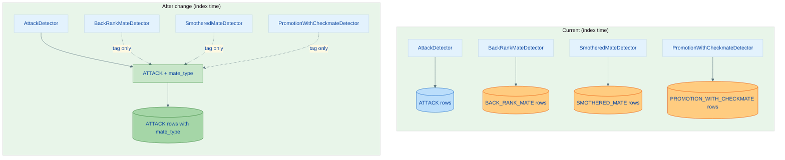
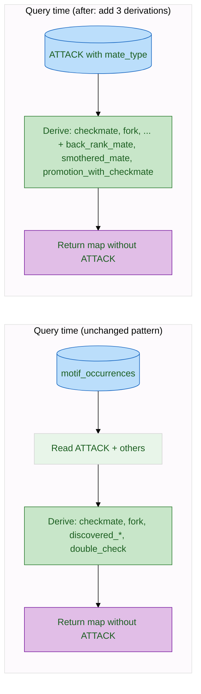
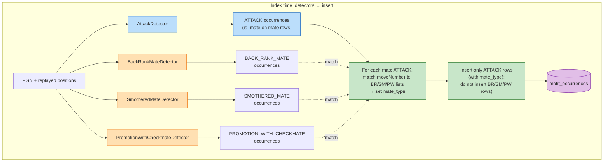
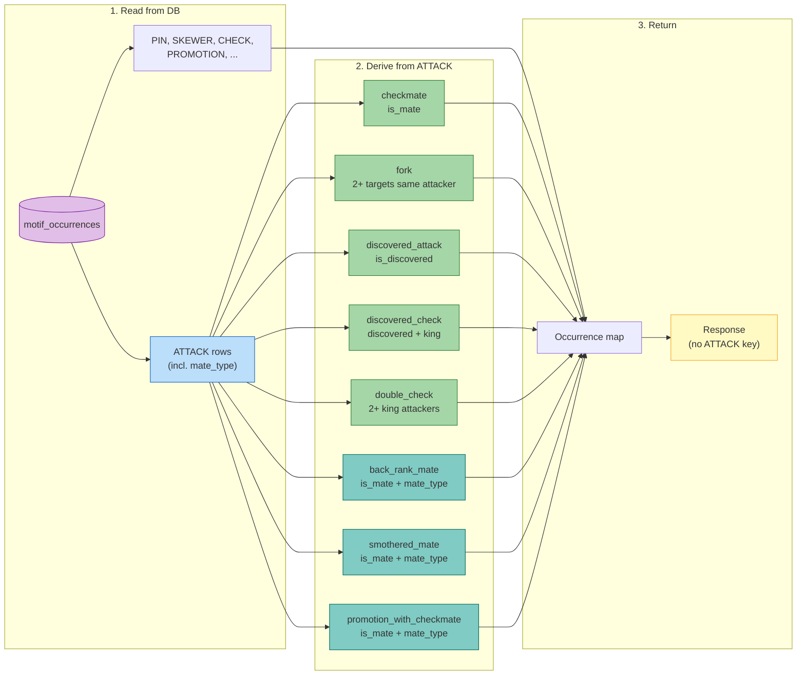
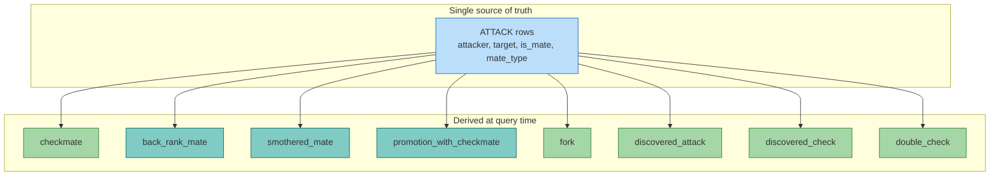

# Plan: Derive Back-Rank Mate, Smothered Mate, and Promotion-with-Checkmate from ATTACK

This document describes how to derive **back_rank_mate**, **smothered_mate**, and **promotion_with_checkmate** at query/response time from ATTACK rows, in the same way that **checkmate**, **fork**, **discovered_attack**, **discovered_check**, and **double_check** are already derived. The goal is a single source of truth (ATTACK) for all mate-related motifs and no separate indexed rows or dedicated detector output for these three subtypes.

---

## Overview: Current vs New Flow

---

## Current State

- **ATTACK** is the only motif stored for “piece attacks piece” (including check and checkmate). Each row has `attacker`, `target`, `is_discovered`, `is_mate`, etc.
- At **query time**, `GameFeatureDao.queryOccurrences()`:
  - Reads ATTACK rows (and other non-derived motifs) from `motif_occurrences`.
  - **Derives** checkmate, fork, discovered_attack, discovered_check, double_check from ATTACK.
  - Removes ATTACK from the returned map (it is an internal primitive).
- **Back-rank mate**, **smothered mate**, and **promotion_with_checkmate** are today produced by dedicated detectors (`BackRankMateDetector`, `SmotheredMateDetector`, `PromotionWithCheckmateDetector`) and **stored as separate motif rows** (BACK_RANK_MATE, SMOTHERED_MATE, PROMOTION_WITH_CHECKMATE).

---

## Why Derivation Requires Extra Data

The existing derived motifs use only ATTACK columns:

- **Checkmate**: `is_mate = true`.
- **Fork**: same (moveNumber, side, attacker), 2+ targets.
- **Discovered check**: `is_discovered = true` and target is king.

The three mate subtypes cannot be inferred from ATTACK alone:

| Subtype                 | What we need beyond (attacker, target, is_mate)        |
|-------------------------|--------------------------------------------------------|
| Back-rank mate          | King on back rank (from target) **and** escape blocked by own pieces (needs board). |
| Smothered mate          | Attacker is knight (from attacker) **and** king has no empty adjacent square (needs board). |
| Promotion with checkmate| Last move was promotion **and** promoted piece gives mate (needs move/board).        |

So we cannot derive these subtypes at query time from current ATTACK columns only. We need **one extra piece of information per mate ATTACK** at index time, then derivation is a simple filter.

---

## Approach: Store Mate Subtype on ATTACK Rows

1. **Add a `mate_type` column** to `motif_occurrences` (nullable). Values: `'BACK_RANK_MATE'`, `'SMOTHERED_MATE'`, `'PROMOTION_WITH_CHECKMATE'`, or `NULL` (generic checkmate).
2. **At index time**, when writing ATTACK rows with `is_mate = true`, set `mate_type` by matching the checkmate to the outputs of the existing back-rank, smothered, and promotion-with-checkmate detectors (same game, same move number / position). No new detector logic; reuse current detectors only to **classify** the mate ATTACK.
3. **At query time**, derive the three motifs by filtering ATTACK rows where `is_mate` and `mate_type` is the corresponding value; emit one derived occurrence per such row (same shape as current checkmate derivation). Do **not** read stored rows for BACK_RANK_MATE, SMOTHERED_MATE, PROMOTION_WITH_CHECKMATE (exclude them from the query like FORK/CHECKMATE).
4. **Stop inserting** separate rows for BACK_RANK_MATE, SMOTHERED_MATE, PROMOTION_WITH_CHECKMATE. The three detectors still run so we have a list of (moveNumber, …) for each subtype; that list is used only to set `mate_type` on the corresponding mate ATTACK row.

Result: one ATTACK row per checkmate (with optional `mate_type`); back_rank_mate, smothered_mate, and promotion_with_checkmate exist only as derived views of ATTACK, consistent with checkmate/fork/discovered_check.

---

## Implementation Steps

### 1. Schema and DTO

- **Migration**: `ALTER TABLE motif_occurrences ADD COLUMN IF NOT EXISTS mate_type VARCHAR(32)`.
- **OccurrenceRow** (or the internal row type used when reading): add optional `mateType` (e.g. `String` or enum) so that when we read ATTACK rows we have `mate_type` for derivation.
- **Insert**: extend the INSERT statement and `insertOccurrences` to accept and write `mate_type` for ATTACK rows (nullable).

### 2. Index Time: Set `mate_type` When Inserting ATTACK

- In **GameFeatureDao.insertOccurrences** (or the worker code that builds the insert payload): when iterating over ATTACK occurrences, for each occurrence with `isMate() == true`:
  - Determine `mate_type` by checking whether the same (gameUrl, moveNumber) [or (gameUrl, ply)] appears in:
    - `occurrences.get(Motif.BACK_RANK_MATE)`
    - `occurrences.get(Motif.SMOTHERED_MATE)`
    - `occurrences.get(Motif.PROMOTION_WITH_CHECKMATE)`
  - At most one of these should match (subtypes are mutually exclusive). Set that as `mate_type`; if none match, leave `mate_type` NULL.
- When building the batch of rows to insert, **do not** add rows for BACK_RANK_MATE, SMOTHERED_MATE, PROMOTION_WITH_CHECKMATE to the insert list. Only ATTACK (and other non-derived motifs) are written; ATTACK rows carry `mate_type`.

So the three detectors continue to run and their results are used only to tag mate ATTACKs; no separate rows for those three motifs are persisted.

### 3. Query Time: Exclude and Derive

- In **GameFeatureDao.queryOccurrences**:
  - **Exclude** BACK_RANK_MATE, SMOTHERED_MATE, PROMOTION_WITH_CHECKMATE from the `WHERE motif NOT IN (...)` list so we never read previously stored rows for them (same as FORK, CHECKMATE, etc.).
  - When reading ATTACK rows, read the new `mate_type` column into the in-memory row type.
  - After deriving **checkmate** from ATTACK (`is_mate`), add three new derivations:
    - **back_rank_mate**: from ATTACK rows where `is_mate` and `mate_type == "BACK_RANK_MATE"` (or equivalent). Build one occurrence per row (same shape as `deriveCheckmateOccurrences`: gameUrl, motif name, moveNumber, side, description, movedPiece, attacker, target, is_discovered=false, is_mate=true, pinType=null).
    - **smothered_mate**: same, for `mate_type == "SMOTHERED_MATE"`.
    - **promotion_with_checkmate**: same, for `mate_type == "PROMOTION_WITH_CHECKMATE"`.
  - Add these to the motif map with keys `"back_rank_mate"`, `"smothered_mate"`, `"promotion_with_checkmate"` (lowercase to match existing convention).

### 4. ChessQL / Query Layer

- **SqlCompiler** (and DataFusionSqlCompiler) already treat these motifs as first-class (e.g. `motif(back_rank_mate)`). No change needed if the API returns derived occurrences under those names.
- **QueryController** / response mapping: ensure that when we return occurrences by motif name, the derived lists for back_rank_mate, smothered_mate, promotion_with_checkmate are included (they will be, if we put them in the same map returned by `queryOccurrences`).

### 5. Backfill and Cleanup

- **Existing data**: Games indexed before this change have BACK_RANK_MATE, SMOTHERED_MATE, PROMOTION_WITH_CHECKMATE as stored rows and ATTACK rows without `mate_type`. Options:
  - **Option A**: Leave old data as-is. Query logic: when building the occurrence map, if we have stored rows for back_rank_mate/smothered_mate/promotion_with_checkmate (e.g. from an older schema that didn’t exclude them), merge them into the result; for games that have ATTACK + mate_type, use derivation only. That implies we do **not** exclude the three from the SELECT initially, and we either (i) derive only when mate_type is present and no stored rows, or (ii) prefer derived over stored when both exist. Simplest: exclude the three from SELECT (so old stored rows are never read); then old games simply won’t show these subtypes until re-indexed.
  - **Option B**: One-time backfill that, for each game that has ATTACK rows with is_mate but no mate_type, runs the three detectors (from stored PGN), matches mate ATTACKs to detector output, and updates `mate_type` on those ATTACK rows; then deletes stored BACK_RANK_MATE/SMOTHERED_MATE/PROMOTION_WITH_CHECKMATE rows for that game.
- **Cleanup**: Once all relevant games have ATTACK.mate_type set (or we accept that old games lack subtype), we can remove the three dedicated detectors from the **index pipeline** only if we are comfortable losing subtype for games that haven’t been re-indexed. Alternatively, keep the detectors forever at index time purely to set `mate_type` (no separate inserts).

### 6. Tests and E2E

- **GameFeatureDaoTest**: extend tests that insert ATTACK + mate to also set mate_type and assert that queryOccurrences returns derived back_rank_mate / smothered_mate / promotion_with_checkmate as appropriate.
- **E2E**: ensure motif(back_rank_mate), motif(smothered_mate), motif(promotion_with_checkmate) still return the expected games (Opera Game etc.) after the change. If we exclude the three from the SELECT and don’t backfill, re-index those games once so ATTACK rows get mate_type.

---

## Summary Table

| Motif                    | Today                         | After change                          |
|--------------------------|-------------------------------|----------------------------------------|
| checkmate                | Derived from ATTACK (is_mate) | Unchanged                              |
| back_rank_mate           | Stored (dedicated detector)   | Derived from ATTACK (is_mate + mate_type) |
| smothered_mate           | Stored (dedicated detector)   | Derived from ATTACK (is_mate + mate_type) |
| promotion_with_checkmate | Stored (dedicated detector)   | Derived from ATTACK (is_mate + mate_type) |

Index time: ATTACK rows with `is_mate` get `mate_type` set using existing detector output; no rows inserted for the three subtypes. Query time: three new derivation branches from ATTACK, same pattern as checkmate; stored rows for the three subtypes are no longer read (excluded from SELECT).

