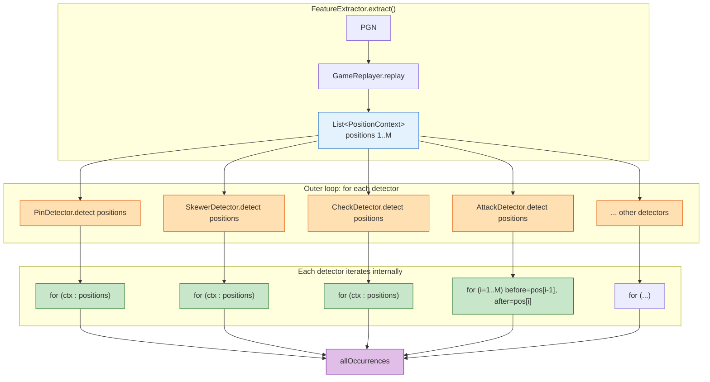
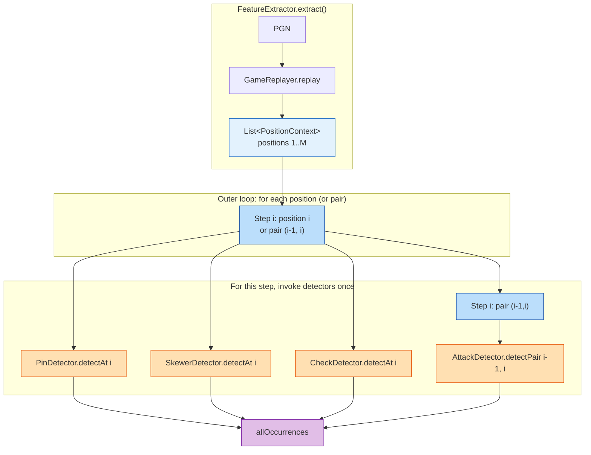
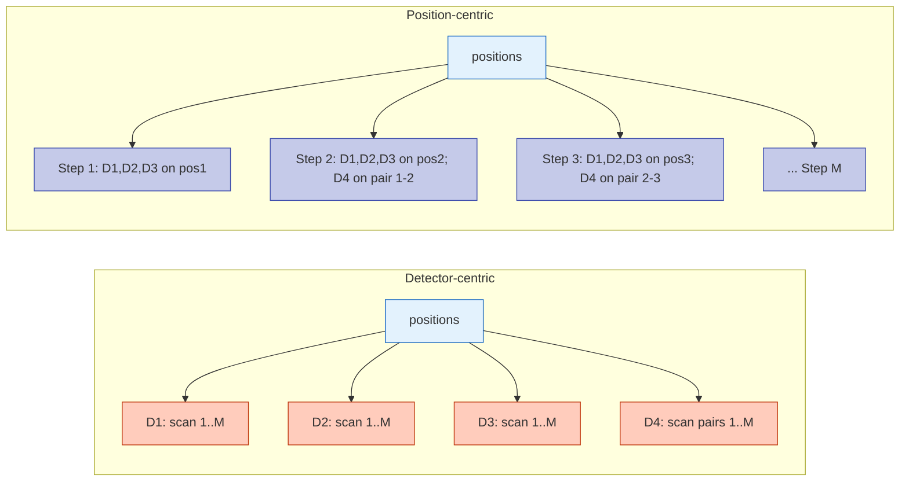
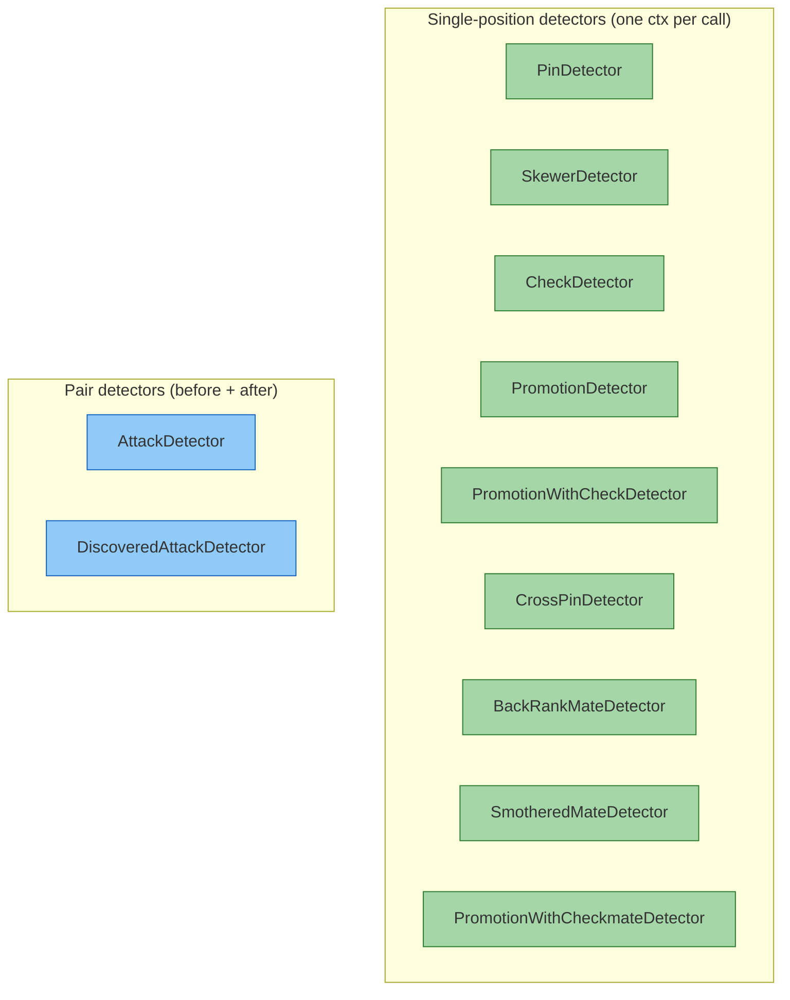
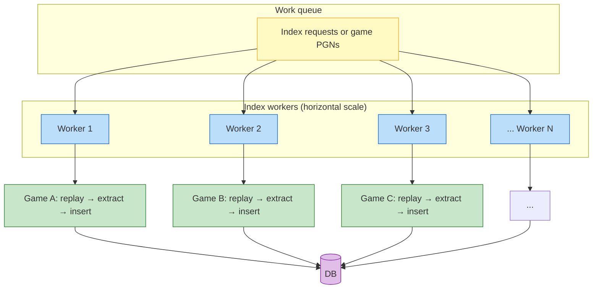
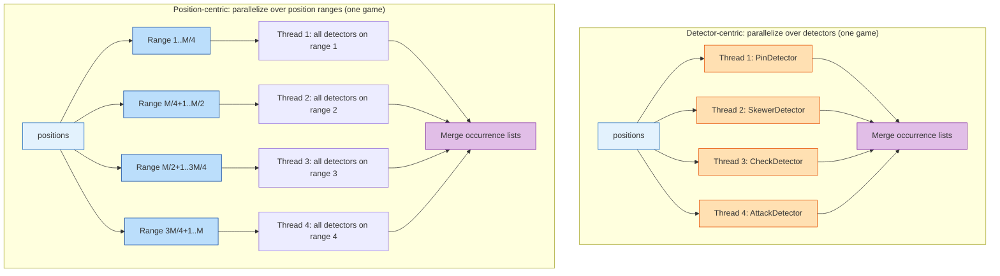

# Trade-offs: Detector-Centric vs Position-Centric Iteration

This document analyzes two ways to run motif detection over a game’s positions:

1. **Current (detector-centric):** The orchestrator calls each detector once with the full list of positions; each detector iterates through every position (or every pair) itself.
2. **Alternative (position-centric):** The orchestrator iterates over positions (or position pairs) and invokes each detector once per position (or per pair).

We compare them for cache locality, memory use, API design, and parallelism, and include diagrams with a consistent color scheme.

---

## Current Approach: Detector-Centric

The **FeatureExtractor** loops over detectors. Each detector receives the entire `List<PositionContext>` and performs its own loop over positions (or over consecutive pairs).

**Access pattern:** Detector 1 touches position 1, 2, …, M; then detector 2 touches 1, 2, …, M; and so on. So the same positions are revisited once per detector.

---

## Alternative Approach: Position-Centric

The orchestrator loops over **positions** (or over **index** for pair-based logic). For each step, it invokes every detector that cares about that step, passing a single position or a (before, after) pair.

**Access pattern:** For position i we load position i (and i−1 when needed) once and run all single-position detectors; for pair (i−1, i) we run pair-based detectors. Each position’s data is touched only when that position (or pair) is the current step.

---

## Side-by-Side Data Flow

---

## Trade-offs Summary

| Dimension | Detector-centric (current) | Position-centric (alternative) |
|-----------|----------------------------|----------------------------------|
| **Cache locality** | Positions are re-scanned per detector: position 1, then 2, … then again from 1 for the next detector. More cache misses when the position list doesn’t fit in cache. | Each position (or pair) is loaded once per “step”; all detectors that need that step run before moving on. Better locality for position data. |
| **Memory** | One shared list; each detector only holds references and local state. Low and simple. | Same list; orchestrator may need to pass (before, after) or (list, index). Similar memory use. |
| **API** | Simple: `detect(List<PositionContext> positions)`. Detector owns its iteration and can optimize (e.g. skip last N, or only last position for mate). | Needs a different contract: e.g. `detectAt(List<PositionContext> positions, int index)` for single-position, and `detectPair(positions, index)` or `detect(before, after)` for pair-based. More variants or a single “step” type. |
| **Pair-based detectors** | AttackDetector and DiscoveredAttackDetector naturally loop over `i = 1..size-1` and use `positions.get(i-1)`, `positions.get(i)`. No API change. | Orchestrator must drive “steps” for pairs (e.g. for i in 1..M-1 call AttackDetector with (positions.get(i-1), positions.get(i))). Same work, different owner. |
| **Parallelism** | Easy to parallelize **over detectors**: run each detector on the full list in parallel (each thread gets one detector). No shared mutable state between detectors. | Easy to parallelize **over positions**: each thread gets a range of indices and runs all detectors for those steps. Fewer positions per thread can mean better locality; need to merge occurrence lists. |
| **Code clarity** | Each detector’s logic (including “which positions I care about”) lives in one place. FeatureExtractor stays trivial. | Orchestrator must know which detectors need single position vs pair and call them in the right way. More logic in the orchestrator; detectors become simpler per-call but the “schedule” is centralized. |
| **Short-circuit / early exit** | Detectors can skip positions (e.g. mate detectors that only look at the last position). No change. | Orchestrator can avoid calling a detector for steps it doesn’t care about (e.g. call BackRankMate only for the last step). Requires orchestrator to encode that knowledge. |

---

## Detector Categories

Not all detectors use positions the same way. The trade-offs depend on that.

- **Single-position:** In a position-centric design, the orchestrator would call each of these once per position (or, for mate detectors, only for the last position if we encode that).
- **Pair:** The orchestrator would call once per consecutive pair (e.g. indices 1..M−1 with `(positions.get(i-1), positions.get(i))`).

---

## Horizontal Scaling of Index Workers

When we **scale out** by running many index workers (e.g. multiple processes, containers, or nodes), each worker typically:

- Pulls work from a shared **queue** (index requests or per-game tasks).
- Processes one or more games at a time (replay → extract → insert).
- Shares no mutable state with other workers; each game is independent.

Under that model, the choice between detector-centric and position-centric iteration affects **per-worker behavior**, **memory footprint**, and **how we use multiple cores inside a worker**. This section analyzes those effects.

### Scaling model

- **Adding workers** increases total throughput (more games per second) as long as the queue and downstream (DB, API) can keep up. Neither iteration style blocks horizontal scaling: workers remain stateless and independent.
- The **iteration style** matters for (a) how many games one worker can process in parallel (memory and locality), and (b) how we use multiple cores **within** one worker for a single game.

### Per-worker parallelism: two ways to use multiple cores

Within a **single worker** that processes multiple games (e.g. a thread pool), we can either:

- **Parallelize over games:** each thread takes a different game and runs the full pipeline (replay → all detectors → collect results). No change to detector-centric vs position-centric; each game still uses one of the two iteration styles on its own position list.
- **Parallelize within one game:** use multiple threads for a single game’s extraction. Here the iteration style matters.

- **Detector-centric + parallel over detectors:** Each thread runs one (or a subset of) detectors on the **full** position list. No coordination between threads; merge is trivial (concatenate per-motif lists). Drawback: every thread touches the whole list, so memory bandwidth and cache pressure scale with the number of detector-threads.
- **Position-centric + parallel over position ranges:** Each thread runs **all** detectors on a slice of positions (or pairs). Each thread touches a contiguous slice; better locality and less cross-thread cache contention. Drawback: pair-based detectors need pairs that span the slice boundary (e.g. last position of range 1 and first of range 2); we must either handle boundary pairs in one thread or add a separate pass for pairs.

### Trade-offs under horizontal scaling

| Dimension | Detector-centric (many workers) | Position-centric (many workers) |
|-----------|----------------------------------|----------------------------------|
| **Scale-out** | Add more workers → more games/sec. No difference between iteration styles; both are stateless per game. | Same. |
| **Memory per worker** | One game’s position list per in-flight game. If we run K games in parallel per worker (e.g. thread pool), we hold K lists. ~tens of MB per game (see PARALLELIZING_INDEXING / IN_PROCESS_MODE). | Same per game. Slightly different access pattern doesn’t change the size of the position list. |
| **Parallel games per worker** | Straightforward: submit each game to an executor; each task runs `extract(positions)` with detector-centric loop. No coupling between games. | Same: each game is an independent `extract` with position-centric loop. |
| **Parallel within one game (multi-core worker)** | **Over detectors:** simple. N threads, each runs a subset of detectors on the full list; merge lists at the end. Load balance depends on detector cost (AttackDetector heavier than e.g. CheckDetector). | **Over position ranges:** better locality; each thread touches a subset of positions. Requires handling pair boundaries (AttackDetector) and merging per-position results. More orchestration. |
| **Cache / bandwidth when many workers** | Each worker (or each core) repeatedly scans its game’s list. On a packed node with many workers, total memory bandwidth can become a bottleneck; detector-centric does more full-list scans. | Position-centric reduces full-list scans per game; when we parallelize over positions, each core works on a smaller window. Can reduce per-worker bandwidth and improve throughput when many workers share a node. |
| **Operational simplicity** | One code path: every worker runs the same detector-centric extract. Tuning = worker count, games in flight per worker, and (if needed) detector-level parallelism. | Same single path per worker if we adopt position-centric; tuning is similar. If we add “parallel over positions” inside one game, we add a second parallelism dimension to reason about. |

### Recommendation when scaling horizontally

- **Scale-out (more workers):** Use the same iteration style everywhere; add workers until queue or DB is the bottleneck. Detector-centric is fine and keeps the implementation simple.
- **Scale-up (more cores per worker, parallel within a game):** Prefer **parallel over detectors** (detector-centric) first: minimal code change, trivial merge. If profiling shows that a single game’s extraction is CPU-bound and detector-centric parallelization doesn’t scale (e.g. memory bandwidth bound), consider **position-centric with parallel position ranges** and explicit handling of pair boundaries.
- **Many workers on one node:** If you run a high number of workers per machine, memory bandwidth can dominate. Position-centric (and, if used, parallel-over-positions) tends to reduce redundant scans of the same position list and may allow more workers per node before bandwidth saturates.

---

## When Position-Centric Can Win

Position-centric iteration is more attractive when:

1. **Games are long** and the position list is large, so re-scanning it per detector causes noticeable cache/bandwidth pressure.
2. **We parallelize over positions** (e.g. per-position or per-range tasks) and want each task to touch a small, contiguous slice of data.
3. **We add cost per position** (e.g. parsing FEN into a board once per position and reusing that for all detectors at that position); then “one pass per position” amortizes that cost.
4. **We scale out with many workers per node** and memory bandwidth becomes a bottleneck; position-centric reduces full-list scans per game and can allow more workers per machine before bandwidth saturates (see [Horizontal scaling](#horizontal-scaling-of-index-workers)).

It is less attractive when:

1. **Detectors already short-circuit** (e.g. mate detectors that only look at the last position); the current design avoids unnecessary work inside the detector.
2. **We prefer parallelizing over detectors** (each detector is independent and gets the full list); detector-centric keeps that model simple.
3. **We want to keep a single, simple API** (`detect(List<PositionContext>)`) and let each detector own how it walks the list.

---

## Recommendation (Summary)

- **Keep detector-centric iteration** unless profiling shows that position-list access is a bottleneck (e.g. cache misses or memory bandwidth).
- **If we move to position-centric**, introduce a clear “step” abstraction (single position vs pair) and have the orchestrator drive steps and call detectors per step; use a diagram similar to the “Position-centric” one above to document the intended flow.
- **When scaling horizontally:** Both styles scale out (add workers) equally well. To use multiple cores *within* one worker on a single game, prefer parallel-over-detectors (detector-centric) first; consider position-centric with parallel position ranges only if bandwidth or locality becomes the limit (see [Horizontal scaling](#horizontal-scaling-of-index-workers)).
- **Optimizations that work with both:** Reduce work per position inside detectors (e.g. only consider the last position for checkmate subtypes), and avoid re-parsing FEN when possible (e.g. shared board representation per position). These don’t require changing who iterates.

---

## Diagram Legend

| Color / style | Meaning |
|---------------|--------|
| **Light blue** (`#E3F2FD`, `#BBDEFB`) | Position list or single position / step |
| **Amber / orange** (`#FFE0B2`, `#FFCCBC`) | Detectors |
| **Green** (`#C8E6C9`, `#A5D6A7`) | Inner iteration or single-position detectors |
| **Blue** (`#90CAF9`) | Pair-based detectors |
| **Purple** (`#E1BEE7`) | Output (occurrences) |
| **Indigo** (`#C5CAE9`) | Position-centric “step” invocations |
