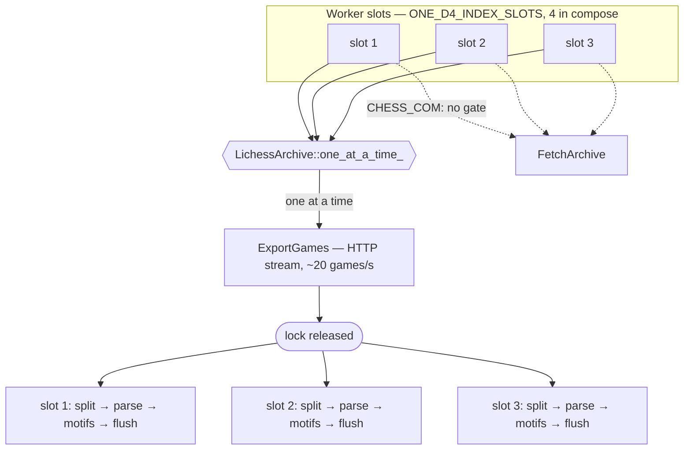

# one_d4_worker — the C++ index worker

Claims a range off `indexing_requests`, reads the months from chess.com,
extracts features and motifs, and writes `game_features`,
`motif_occurrences` and `indexed_periods`. Tracking issue: MoonBase#1389.

It is the only indexer. The table is the queue (#1279) — any number of
these workers poll the same rows under the same claims, leases and fences.
It creates no schema — that lives in one_d4's `migrations/` .sql files
(#1419), applied by the `one_d4_migrate` deploy step this worker gates on,
so it no longer waits for the Java service to be up.

```bash
ONE_D4_DB_URL=postgresql://... bazel run //domains/games/apis/one_d4_worker
kill -TERM <pid>   # drains the runs in flight and exits 0
```

## The second queue: reanalysis

Each instance also polls `reanalysis_requests` on a thread of its own
(#1389 phase 5). A pass re-extracts every stored game against the current
detectors — same code the index path runs, on `pgn` already in the table,
so no chess.com call and no network at all.

**Its own table, not a job type on `indexing_requests`.** Index pollers
claim from that table with no job-type predicate, so a reanalysis row
there is one an indexer takes, finds no player or months on, and fails —
spending an attempt on work it cannot do. Separate tables make that
unreachable rather than a filter every present and future poller has to
remember.

**Its own thread, not a pool slot.** A pass runs for hours; a slot spent
on one is a slot not indexing. And one is the fleet-wide total:
`idx_reanalysis_requests_single_live` — a partial unique index over
liveness — refuses a second live row at insert, so replicas cannot walk
the corpus twice however many of them poll.

**It resumes.** Progress writes the last `game_url` a finished page
covered along with the counts, in one statement, so a pass that loses its
lease or hits the six-hour ceiling picks up where it stopped instead of
walking the corpus again. That is also why the ceiling refunds the
attempt when the cursor moved: a pass making progress on a large corpus
is not a wedged one, and spending an attempt each time would retire the
request after three before it ever reached the end. A ceiling that moved
*nothing* still spends it.

Scaling out does not speed a pass up — one owner at a time is the point —
but it does mean any instance can pick up a pass whose owner died.

## Where titles come from

Per platform, because a username means a different player on each one.

chess.com states a title on no game at all — zero of hikaru's 493 games in
August 2026 carry a `*Title` tag — so the worker reads the ten
`/pub/titled/{title}` rosters once and answers from memory. Lichess writes
`[WhiteTitle]` / `[BlackTitle]` on the game itself and has no roster
endpoint, so it is registered with no roster and the title costs nothing.

A platform with no roster is not a platform whose roster failed: its months
are complete. Only a roster that was supposed to load and did not degrades
one, because that is a title nobody will go back and correct.

Titles a game states are also written to `player_titles`, dated by the game
rather than by the write — indexing is not chronological, and a backfill of
2019 running after 2026 would otherwise demote a current GM. Roster titles
are not written that way: the roster describes now.

## Scaling out

There is no ingress. Nothing routes to this service, nothing load
balances it, and no replica is addressable — every instance finds its own
work by claiming rows. That makes scaling out unusually cheap, and it
means the two axes are independent.

**Within a process: `ONE_D4_INDEX_SLOTS`** (default 4, capped at 16).
Each slot is a thread that claims a request and runs it. A run is mostly
waiting on chess.com and on Postgres, so size this for concurrent calls
rather than for the CPU cap.

**Across processes: replicas.** Start another container. There is nothing
to configure and nothing to tell it about its siblings — no leader, no
partitioning, no shard map, no coordination of any kind.

`deploy/consolidated/compose.yaml` sets no `replicas` today, so this is
the untried axis of the two. The service is shaped for it — no
`container_name`, no ports, no ingress — and the deploy runs `docker
compose up -d`, which honours `deploy.replicas`:

```yaml
one_d4_worker:
  deploy:
    replicas: 3          # alongside the resources.limits already there
```

Both axes multiply: three replicas of four slots is twelve requests at
once — and the Postgres connections are the ceiling to check first.
Each slot holds two (its queue and its run's sink), and each instance
adds one more for the reanalysis poller plus a second while a pass is
actually running: four slots is 8–10 per instance, three replicas 27–30.

### Why that needs no coordination

`ClaimNext` is one conditional `UPDATE` whose candidate is chosen `FOR
UPDATE SKIP LOCKED`, so two claimants racing for a row cannot both win —
the row lock decides and the loser's `WHERE` no longer matches. A claim
somebody holds live is not a candidate at all. Every write after the
claim — heartbeat, progress, the terminal write, and the sink's own
writes — is fenced on the `owner_id` that claimed it, and each *run*
claims under a token of its own, so a wedged run cannot be mistaken for
its replacement.

That is what makes a replica safe to add or remove at any moment. A
worker that dies mid-run strands its claim only until the lease expires
(5 minutes), after which any other worker takes the range and spends an
attempt on it; three attempts retire the request.

### What actually limits it

Scaling out is cheap, not free. The three ceilings, in the order you will
hit them:

| | cost per slot | where it bites |
|---|---|---|
| Postgres connections | 2 — one to claim and renew over, one to flush over | `max_connections` is 100 by default, shared with one_d4 and games_hub |
| chess.com requests | 1 concurrent | a run fetches one month at a time, so `slots × replicas` is the concurrency against a rate-limited API |
| Lichess exports | 1 concurrent **per process, enforced** | Lichess refuses concurrent exports outright; see below |
| CPU | fraction of one | PGN replay and motif detection; `cpus: '0.5'` in compose bounds it |

Neither connection may be shared. A heartbeat queued behind a flush is a
lease lost under a healthy run, and one `pg::Client` is one connection
serialised by a mutex.

### Why Lichess is gated and chess.com is not

chess.com tolerates `slots × replicas` concurrent requests and merely rate
limits. Lichess refuses them: a second export in flight answers 429 *Please
only run 1 request(s) at a time*, and the cooldown has outlasted a
75-second backoff. So `LichessArchive` holds a mutex across the export —
and across nothing else.

That distinction is the whole design. The lock covers the HTTP stream; the
PGN split, the replay, the motif detection and the flush all happen outside
it, so one slot streaming does not stop the others computing.



Serialised IO, parallel CPU, and pipelined: while one slot is detecting
motifs, the next is already streaming.

A dedicated IO thread would add nothing over this. A run cannot compute
before its own month arrives, so parking on a mutex and parking on a queue
reply are the same park, and the ceiling is Lichess's 20 games/second
either way.

What the gate does cost is slots. A run waiting on it holds its claim, its
lease and its two Postgres connections while doing nothing, for as long as
the export ahead of it takes — up to `request_timeout_ms`, ten minutes. With
every slot on a LICHESS request, the worker is one stream wide and the rest
is parked, including against chess.com work that has no such rule.

So it does not claim one. `Poller::Options::platform_limits` caps LICHESS at
one run per process, and the cap is applied when the row is *claimed*: a
request for a platform this process is full on is not a candidate, stays
PENDING, and is passed over for one the process can run. Parking on the
mutex was the symptom; claiming the row was the cause.

**Per process, not per fleet.** Replicas each get their own cap, so three of
them are three concurrent exports against a rule Lichess states globally.
`compose.yaml` sets no `replicas` today, which is the only reason that is
survivable. The fleet-wide version is a partial unique index over liveness,
exactly as `idx_reanalysis_requests_single_live` already does for reanalysis,
and belongs with whatever makes replicas real.

### Reading the log

Every run's lines are tied together by the request id, which matters
because slots interleave:

```
Claimed 4f3c… hikaru 2026-01..2026-03 as cpp/indexer-7/1234/9a1f…
Finished 4f3c… completed in 84213ms
```

A reanalysis pass says where it resumed from and what it got through:

```
Claimed reanalysis request_id=b925… from=start owner=cpp/indexer-7/1234/3fc5…
Finished reanalysis request_id=b925… processed=2 failed=1
```

`from=start` is a fresh pass; anything else is the cursor it resumed at.
`failed` counts games whose stored PGN would not replay — those still get
their occurrences cleared, because a game whose second look finds nothing
must not keep the rows it had.

`Draining N indexing threads` on the way out means shutdown is waiting
for runs in flight — expected, and it can take as long as a chess.com
call a run is already inside, which is why the stop grace is 240s.

## Configuration

| | |
|---|---|
| `ONE_D4_DB_URL` | required; no default, the worker exits 1 without it |
| `ONE_D4_INDEX_SLOTS` | requests at once, default 4, capped at 16 |
| `ONE_D4_POLL_SECONDS` | how long to wait before asking an empty queue again, default 5 |

The lease, its renewal interval, the run ceiling and the retention windows
are not configurable, by design. They are protocol constants of the queue —
two pollers that disagree about them misbehave against each other — so they
come from one file, `one_d4/retention_policy.json`, which the Java service
reads off its classpath and this worker reads out of its image at startup,
at a path derived from `argv[0]` and nothing else.

There is no variable that points either reader somewhere else. One would let
a deployment run windows no test has seen while the service, which never had
an equivalent, went on quoting users the numbers in the shipped file — a
fleet split across two policies, which is the failure this arrangement
exists to prevent. Changing a window is an edit to that file.

The worker validates the file and exits 1 rather than starting without it:
a worker that cannot read its windows would otherwise pick some and start
deleting against them. `retention_policy_test` covers the loader and the
shipped file's own validity, so a policy that would take the fleet down
fails the build instead of the next deploy.
