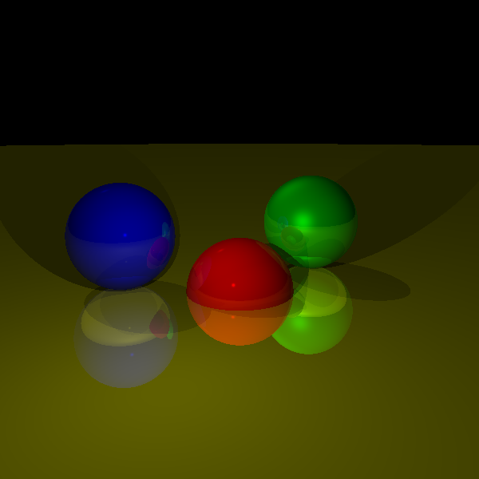

# Tracy - Go Ray Tracer

A ray tracer implementation in Go following [computer graphics from scratch](https://gabrielgambetta.com/computer-graphics-from-scratch/).

This is a port of the Scala version located [here](../../jvm/src/main/scala/com/muchq/scraphics).

## Output



## Features

- 3D vector math operations (Vec3, Vec2)
- Color operations with RGB support
- Sphere primitives with material properties
- Multiple light types (ambient, point, directional)
- Ray-sphere intersection calculations
- Lighting computation (diffuse and specular)
- Ray reflection for mirror-like surfaces
- Shadow casting
- Image rendering to pixel buffer

## Architecture

The ray tracer consists of several key components:

- **Vec3/Vec2**: Vector mathematics for 3D calculations
- **Color**: RGB color representation and operations
- **Sphere**: Geometric primitives with material properties (color, specular, reflective)
- **Light**: Light sources with different types and intensities
- **Scene**: Container for all objects, lights, and camera settings
- **Image**: Pixel buffer for rendering output
- **Tracer**: Core ray tracing algorithms

## Usage

```bash
# Build the ray tracer
bazel build //go/tracy

# Run the ray tracer
bazel run //go/tracy

# Run tests
bazel test //go/tracy:tracy_test
```

## Ray Tracing Pipeline

1. **Ray Generation**: Cast rays from camera through each pixel
2. **Intersection Testing**: Find closest sphere intersection along each ray
3. **Lighting Calculation**: Compute diffuse and specular lighting at intersection points
4. **Shadow Testing**: Check for objects blocking light sources
5. **Reflection**: Recursively trace reflected rays for mirror surfaces
6. **Color Composition**: Combine local color with reflected contributions

## Material Properties

- **Color**: Base RGB color of the object
- **Specular**: Controls shininess (higher values = shinier surfaces)
- **Reflective**: Controls mirror-like reflection (0.0 = matte, 1.0 = perfect mirror)

## Supported Light Types

- **Ambient**: Uniform lighting from all directions
- **Point**: Omnidirectional light from a specific position
- **Directional**: Parallel light rays (like sunlight)