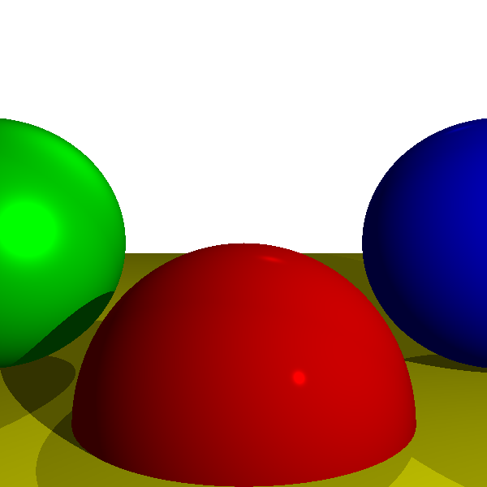

# tracer school

Going through [computer graphics from scratch](https://gabrielgambetta.com/computer-graphics-from-scratch/)

## Build
```
bazel build //src/main/scala/com/muchq/scraphics:Tracer
```

## Run
requires scala 3.x

```
scala src/main/scala/com/muchq/scraphics/Tracer.scala
open tracer_output.png
```

## output

### no light


### with light sources


### with light and reflections


### with shadows


### with reflections

