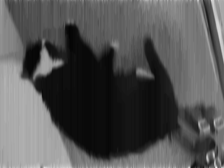
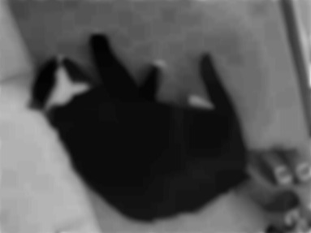

# image stuff

```shell
bazel build //src/main/golang/images
bazel-bin/src/main/golang/images/images_/images static_content/tippo.png 15
open static_content/tippo.png static_content/tippo.png.grey.Box.png static_content/tippo.png.grey.X.png static_content/tippo.png.grey.Y.png
```




